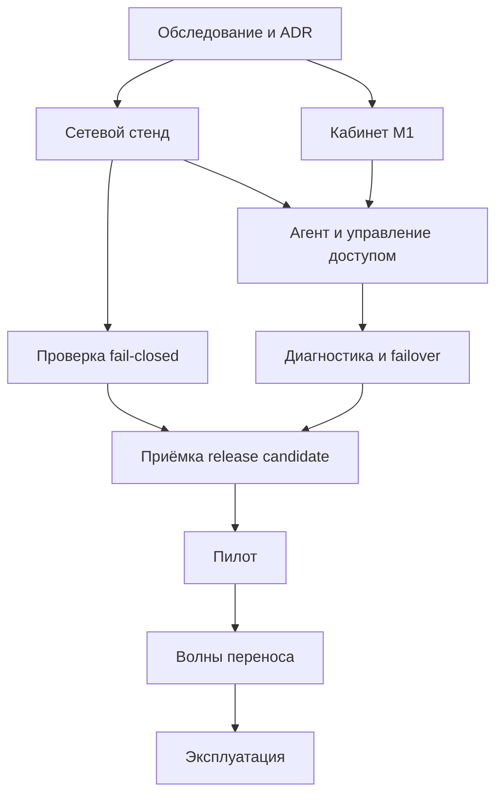

# VPN-платформа: backlog разработки и внедрения

Версия 1.24 · статусы на 9 октября 2026; исходная декомпозиция 29 сентября 2026 · Основание: `vpn-platform-spec-v1.0.md`, сохранённая спецификация 78 784 байта, прочитана перед декомпозицией.

## 1. Как пользоваться

Это snapshot исходного реестра63 задач и текущей поставки; live milestone/task tracking ведётся в Linear. **Статусы обновлены для v0.29.0; исполнители не назначены.** Исходные ID и критерии приёмки сохранены. Частичная реализация не считается Done. Роли ниже обозначают компетенции; один человек может совмещать их. Документ не запускает развёртывание, не создаёт внешние issues и не отправляет приглашения.

Префиксы: PRE — обследование и решения; DEV — программная разработка; NET — инфраструктура и развёртывание на стенде; QA — проверка; ROL — внедрение на действующие серверы и устройства. Разработка проверок начинается вместе с функцией; отдельные QA-задачи означают интеграционную приёмку, а не откладывание тестирования до конца.

Приоритет P0 — обязателен для соответствующего gate, не означает «делать раньше всех». P2 — отключённая по умолчанию опция после v1. Размер S — ориентировочно до одного сосредоточенного рабочего дня, M — 1–3 дня, L — 3–5 дней. Это грубая оценка объёма **после снятия неизвестности**, включая локальные проверки и документацию, без ожидания пользователей и закупок. Не складывать её в календарный прогноз: после M0 и первых завершённых задач провести переоценку. Если L не укладывается в 5 дней, разделить до начала реализации. PRE-04 — ограниченное исследование; если вопрос не решён, результатом становится блокер/ADR, а не вымышленная совместимость.

Роли: DEV — разработчик, OPS — администратор инфраструктуры, QA — проверяющий, USER — владелец реального устройства. В зависимости указан обязательный предшественник для завершения задачи; черновик реализации с fake adapters можно начать раньше. M0–M4 соответствуют разделу 14 спецификации, POST — вне обязательного v1. Задачи NET M0 описывают готовность стенда и могут завершаться после документального gate G0.

Каждая карточка переносится в issue без переименования ID. Поля трекера: ID, тип, milestone, priority, size, роль, assignee, status, depends_on, requirement_refs, описание, критерии приёмки, ссылки на PR/результаты. Статусы: Backlog → Ready → In progress → Review → Verification → Done; Deferred — отложено решением владельца; Blocked указывает причину и следующего владельца действия. «Код написан» не равен Done.

**Объём:** 63 задач: PRE — 7, DEV — 26, NET — 10, QA — 12, ROL — 8. Обязательных — 61, опциональных — 2.

## Текущее решение владельца и ближайшая очередь

30.09.2026: сервис для небольшого круга близких; усложнение авторизации не является приоритетом. Работающий password/TOTP сохраняется. WebAuthn, recovery codes и fresh auth перенесены за текущий семейный MVP. Приглашения, HTTPS, session/CSRF и ownership остаются базой. Неизвестный URL не считается контролем доступа. Эта корректировка снимает последовательную зависимость разработки DEV-06/07/08 от отложенных частей DEV-05; production gates и сетевой fail-closed не объявлены пройденными.

04.10.2026: владелец поставил цель добить backlog итеративно с промежуточными проверенными версиями. Локальные подзадачи и следующие поставки: `delivery-roadmap.md`; реальные deployment/client/пилотные критерии сохраняются.

Ближайшая цель владельца 05.10.2026: **M1/G1 — ручная выдача рабочих профилей**, план `milestone-m1.md`. Очередь: **DEV-08 runtime/client evidence → DEV-09 download/QR → DEV-10/11 инструкции и полный путь → NET-06/QA-01/03 приёмка**. DEV-14/15 задел сохраняется; его дальнейшее развитие после M1. В v0.6 завершён локальный сценарий device request/rename/cancel; в v0.7 — encrypted profile store, отдельные ключи и атомарная ротация. В v0.8 добавлены VLESS/REALITY URI subset, CLI dry-run/apply и pending UI; в v0.9 добавлена pinned Xray configuration preflight; далее runtime/client evidence и verified download; v0.10 дала admin queue/audit, v0.11 — versioned guides/offline, v0.12 — restricted synthetic intents/durable queue с проверенным in-process reconcile; v0.13 — worker/durable retry/cancel/safe CLI pages; v0.14 — AWG3.1 client-only importer с exact bytes и key uniqueness; v0.15 — AWG readback contract и scoped TTL metadata/audit без ready. Unix/production boundary acceptance открыта; перед обещанием совместимости конкретного клиента требуется PRE-04.

Из 63 исходных задач: 3 Verification, 19 In progress, 41 Backlog, 0 Done по полным исходным критериям. Внутри DEV-05 оставшиеся усиления auth — Deferred. Это не 0 написанного кода: локальные завершённые части перечислены в карточках и iteration reports. GW-01…08 — ещё 8 задач Backlog; проектирование в `gateway-backlog.md`, runtime pairing ещё нет.

05.10.2026: Linear подключён и синхронизирован. Проект [Впн](https://linear.app/kukin/project/vpn-d7991a20e59b), KUK-5…8 обновлены, KUK-18/19 добавлены без дублей. KUK-5/M1-02 In Progress; KUK-18 Done только local importer. v0.16 добавляет read-only readiness diagnostics, не закрывая native/client/transition. Mapping: `linear-sync-plan.md`.

Live milestone/task состояние — Linear; этот файл сохраняет критерии и snapshot исходных63 задач для поставки. `iteration-*.md` хранит историю и результаты тестов, `next-iteration.md` — только ближайшие шаги. При каждой поставке синхронизировать все три, не переписывая прошлые отчёты.

07.10.2026 · v0.24: по запросу владельца исправлены review defects и подготовлен переносимый Linux local-auth стенд кабинета. AWG format/pending UI, revoked invite/recovery status, fractional expiry и canonical cancellation audit исправлены; Windows SQLite URI исправлен без ослабления key ownership. Добавлены TLS/frontend startup guards, trusted stand-check с logical read-only DB и явными false VPN/delivery flags, closed Linux bundle/manifest/checksums. DEV-01/02/03/06 и admin/devices UX получили локальные исправления; это не закрывает production criteria. Настоящий Linux/race/admin/import/native/client run остаётся обязательным. Схемы6/4/1 и original63 criteria/statuses45/15/3/0 сохранены. Linear в этой поставке не синхронизировался; last verified online snapshot относится к v0.23. Runtime комплект/инструкция: stand-runbook.md; проверки/ограничения: iteration-24.md.

07.10.2026 · v0.25: owner сообщил о работающем user/admin входе на RU, двух Ubuntu20.04/~1GiB и первом Android клиенте; VPN пока не установлен. Добавлена trusted read-only profile-observe-awg-session: fixed pinned tool, independently bound scope/exact bytes, bounded selected handshake/counters и повторные owner/generation/revision/key/AEAD/format/uniqueness guards. Result отдельный от configuration observation, JSON не создаёт evidence, нет apply/ledger/audit/ready. Local contracts не закрывают actual core/Android/DNS/Foreign-routing acceptance; native positive CLI/store path и audited transition открыты. Snapshot1.20 сохраняет original63 criteria/statuses45/15/3/0. Linear/remote Git/CI для v0.25 не обновлялись. Runbook profile-awg-session-runbook.md; iteration-25.md.

08.10.2026 · v0.26: по запросу владельца встроены root-only pinned static core installer и private Foreign primary REALITY toolset. Xray26.3.27, sing-box1.14.2 musl и Hysteria2.13.0 Linux amd64/arm64 имеют closed official archive/binary SHA/size pins; default dry-run, bounded streaming, protected fixed /usr/bin, atomic no-overwrite. Foreign-init готовит one-RU pair outside portal state, check валидирует exact closed config и опционально fixed pinned run-test; никакого service/firewall/routes/SSH/HTTP root access/ready. PRE-05 переведена In progress за частичную фиксацию inputs; snapshot1.21 сохраняет original63 criteria, counts44 Backlog/16 In progress/3 Verification/0 Done. Native Linux/root boundary execution, kernel isolation, AWG acceptance, Hysteria TLS backup и Android→RU→Foreign остаются открытыми. Linear/remote Git/CI этой версии не обновлялись. Runbook vpn-bootstrap-runbook.md, ADR-0023, iteration-26.md.

08.10.2026 · v0.27: core versions генератора и installer согласованы, закрытая compatibility matrix не подтверждает runtime. User/admin отображают безопасную keyless projection последней owner/current AWG configuration metadata с TTL60s, conflict/stale/future guard; connection/client unknown. Xray API/session readbacks в HTTP не переносятся. Добавлены проверяемые GitHub prerelease build и bootstrap downloader для ручного запуска оператором; remote публикация/CI/VPS в этой локальной задаче не выполнялись. Snapshot1.22 сохраняет original63 criteria/statuses44/16/3/0 и GW8Backlog; DEV-20 реальные probes/failover не реализованы. Runbooks protocol-status-runbook.md/vpn-bootstrap-runbook.md; iteration-27.md.

08.10.2026 · v0.28: по прямому запросу владельца подготовка deployment guide заменена реализацией RU ingress и сетевой изоляции. Добавлены private RU primary templates, Foreign IPv4 adapter и trusted network plan/prepare/apply/check с independently expected boot/netns/helpers, collision checks и kernel readback перед activation. Native forwarding0 требует preservation implementation; cores не запускаются, empty client ingress не выдаёт доступ. Snapshot1.23: NET-03/04/05 In progress, 41 Backlog/19 In progress/3 Verification/0 Done, original criteria/specification сохранены. Linux kernel/service/client/fail-closed acceptance открыта, к VPS не подключались. Runbook network-stand-runbook.md; iteration-28.md.

09.10.2026 · v0.29: по сообщению владельца RU host forwarding0 и Foreign docker0/amn0 с Amnezia UDP30759. Реализованы current-memory/held-procfs-FD preservation с LRO/pending-feature/mixed-forwarding guards и scoped Foreign nft+legacy policy binding. Допустимый bridge NAT disjoint от transit; два точных leading accepts для owned veth идут после owned guard и до UP, свежий readback сохраняет исходную shared policy. Unknown extensions/IPv6 rewrite остаются blocked. Bootstrap tty исправлен; prepare/apply/Verify не запускают cores и не делают ready. Snapshot1.24: 41 Backlog/19 In progress/3 Verification/0 Done, original63/252 normative fields/specification сохранены. Ubuntu kernel/packet/management/recovery и Android acceptance открыты. История опубликованного владельцем v0.28 CI отделена от непубликованного v0.29; Linear не синхронизировался. ADR-0026, iteration-29.md.

## 2. Поставки и условия перехода

| Gate | Что готово | Условие перехода |
|---|---|---|
| G0 | Зафиксирована архитектура и исходное состояние | PRE-01…07, ADR, recovery kit; сеть production не менялась |
| G1 | Кабинет с ручной выдачей на стенде | DEV-01…13, NET-06, QA-01/03; M1 можно демонстрировать без автоматического изменения сети |
| G2 | Автоматическое управление доступом на стенде | DEV-14…19, NET-07, QA-02/04; подтверждены отзыв и crash recovery |
| G3 | Диагностика и автоматическое переключение | DEV-20…23, QA-05/06; обе аварийные ветви fail-closed |
| G4 | Release candidate пригоден для пилота | DEV-25/26, NET-08/09, QA-07…12; ресурсы, recovery и реальные клиенты проверены |
| G5 | Пилот успешен | ROL-01…05; отдельно принято решение о расширении |
| G6 | Все целевые пользователи перенесены | ROL-06…08; остаточные ключи отозваны, backup и runbooks проверены |

G1 — полезный ранний результат, но не разрешение обходить gates сетевой безопасности ради production-пилота. Полноценный v1 на production вводится через G4–G6. Зависимость от присутствия человека с iPhone/Android/Windows планировать заранее.

## 3. Основные зависимости

Основной путь с наиболее существенными рисками: PRE-01 → PRE-04 → NET-03/04/05 → QA-02 → DEV-16/17/18/19 → QA-04 → QA-10/12 → ROL-02…08. Это логический путь обязательных зависимостей, не вычисленный календарный critical path; auth, TLS, клиентская совместимость и backup тоже блокируют выпуск. DEV-01 и проектирование интерфейса по fake adapters могут идти параллельно обследованию. Нельзя параллельно применять разные изменения к одному network state.

## 4. Реестр задач

### Обследование и проектные решения — 7 задач

#### PRE-01 · Обследовать действующие RU и Foreign

**Статус v0.29.0:** Backlog — Результат исходной задачи пока не реализован и не принят.

**Этап:** M0 · **Приоритет:** P0 · **Размер:** M · **Роль:** OPS

**Зависимости:** —. **Основание:** §1; §14 M0.

**Работа и результат:** Снять ОС/ядра, версии, порты, CIDR, routes, nftables, Docker/systemd, действующие peers и владельцев конфигурации; секреты хранить отдельно.

**Приёмка:** Есть sanitized inventory и список конфликтов. Неизвестные данные помечены неизвестными; обследование не меняет сеть.

#### PRE-02 · Проверить существующее аварийное восстановление

**Статус v0.29.0:** Backlog — Результат исходной задачи пока не реализован и не принят.

**Этап:** M0 · **Приоритет:** P0 · **Размер:** M · **Роль:** OPS

**Зависимости:** PRE-01. **Основание:** §4.2; §16.2.

**Работа и результат:** Проверить доступность консоли провайдера и текущего SSH, сохранить зашифрованный исходный backup и recovery kit вне VPS.

**Приёмка:** Зафиксирован проверенный путь возврата до изменений; backup читается на изолированном стенде, секреты не приложены к issue.

#### PRE-03 · Закрепить границы процессов и владельцев состояния

**Статус v0.29.0:** In progress — ADR-0002/0006 и границы процессов реализованы локально; реальное UID/socket isolation ещё не проверено.

**Этап:** M0 · **Приоритет:** P0 · **Размер:** M · **Роль:** DEV+OPS

**Зависимости:** PRE-01. **Основание:** §3; §13; ADR-001; ADR-002.

**Работа и результат:** Описать namespace, права UID/socket, разделение публичной и привилегированной SQLite БД, интерфейс намерений и единственного владельца network config.

**Приёмка:** Две ADR содержат схемы доступа; у portal нет доступа к agent socket, privileged DB и docker.sock. Схема спецификации с логической общей БД уточнена физическим разделением.

#### PRE-04 · Проверить протоколы и форматы до разработки адаптеров

**Статус v0.29.0:** In progress — Официальные AmneziaWG 3.1 и Xray share-link/REALITY документы изучены; VLESS TCP/Vision и AWG3.1 client-only .conf subsets импортируются с byte-exact encrypted storage/rotation round-trip. Новые AWG fields/CPS/clamping uniqueness проверены локально в v0.14. Матрица client-format-matrix.md; native importer/handshake/реальные мобильные клиенты и доступность приложений ещё не проверены. v0.15 проверила локальный AWG readback contract; actual tool/core/client manifest и native round-trip ещё не приняты.

**Этап:** M0 · **Приоритет:** P0 · **Размер:** M · **Роль:** DEV+QA

**Зависимости:** PRE-01. **Основание:** CFG-02; CFG-03; §17; ADR-004.

**Работа и результат:** На стенде зафиксировать версии AWG 3.1/Xray/sing-box, экспорт/импорт, сохранение полей AWG, UDP цепочки и завершение активной Xray-сессии.

**Приёмка:** Есть compatibility manifest и решение по каждому спорному механизму. Неподтверждённые пары app/format не объявлены поддерживаемыми; найденные ограничения внесены в ADR.

#### PRE-05 · Зафиксировать deployment inputs

**Статус v0.29.0:** In progress — Owner inputs два Ubuntu20.04/~1GiB/RU кабинет/Android и closed pins Xray26.3.27/sing-box1.14.2 musl/Hysteria2.13.0 записаны; actual kernel/architecture/ports/recovery/TLS/namespace inventory и AWG compatible core ещё не приняты. Pinned binary installer и Foreign primary staging подготовлены локально, не deployment acceptance. ADR-0023, vpn-bootstrap-runbook.md.

**Этап:** M0 · **Приоритет:** P0 · **Размер:** S · **Роль:** OPS+DEV

**Зависимости:** PRE-01. **Основание:** §4; §5; ADR-003; ADR-006.

**Работа и результат:** Выбрать свободные CIDR/порты, домены, RP ID/origins, способ ACME, management/probe routes и expected egress IP.

**Приёмка:** Заполнен deployment manifest без секретов; для каждого секретного параметра указан способ передачи. Базовый кабинет использует 8443.

#### PRE-06 · Составить threat model и правила изменения состояния

**Статус v0.29.0:** In progress — Trust boundaries и локальные IDOR/crypto/transaction tests есть; полный threat model и network apply ещё впереди.

**Этап:** M0 · **Приоритет:** P0 · **Размер:** M · **Роль:** DEV+QA

**Зависимости:** PRE-03. **Основание:** INV-01; INV-07; §7.1; ADR-005; ADR-007.

**Работа и результат:** Описать theft профилей, IDOR, компрометацию portal, crash apply, stale restore, отзыв и recovery; определить trust boundaries.

**Приёмка:** Каждому риску соответствует контроль и проверка. Утверждены монотонный журнал отзывов и запрет прямых сетевых команд от portal.

#### PRE-07 · Закрыть решения M0

**Статус v0.29.0:** Backlog — Результат исходной задачи пока не реализован и не принят.

**Этап:** M0 · **Приоритет:** P0 · **Размер:** S · **Роль:** DEV+OPS

**Зависимости:** PRE-02,PRE-03,PRE-04,PRE-05,PRE-06. **Основание:** §14 M0; §17.

**Работа и результат:** Собрать inventory, ADR-001…007, matrix, открытые ограничения и план миграции. Не подменять неизвестное оптимистичным допущением.

**Приёмка:** Нет нерешённых вопросов, блокирующих безопасность реализации. Оставшиеся deployment inputs имеют ответственного и срок до пилота; зафиксирован gate G0.

### Разработка — 26 задач

#### DEV-01 · Создать репозиторий и воспроизводимую сборку

**Статус v0.29.0:** Verification — Go/Svelte skeleton, locks, build и local tests работают. Публичный v0.28 был опубликован владельцем; checks run37836903063 SUCCESS08.10, включая Linux race/root filesystem и browser suites. Это не native network acceptance на Ubuntu20.04. Локальный v0.29 требует собственного CI после публикации.

**Этап:** M1 · **Приоритет:** P0 · **Размер:** S · **Роль:** DEV

**Зависимости:** —. **Основание:** §13; INV-10.

**Работа и результат:** Подготовить Go/Svelte структуру, lockfiles, форматирование, CI, fake adapters, конфиг dev без секретов и production auto-deploy.

**Приёмка:** Чистый checkout собирается одной документированной командой; CI выполняет build и выбранные проверки, рабочий VPS не нужен.

#### DEV-02 · Реализовать хранилища и миграции

**Статус v0.29.0:** In progress — Portal v6, control v4, admin v1; migration и persistence tests есть. UID isolation остаётся открытой.

**Этап:** M1 · **Приоритет:** P0 · **Размер:** M · **Роль:** DEV

**Зависимости:** DEV-01,PRE-03. **Основание:** §9; §13.

**Работа и результат:** Создать portal DB и отдельную control DB, связи, unique constraints, timestamps, desired/observed state; миграции версионировать.

**Приёмка:** Публичный UID не читает control DB. Повтор миграции безопасен; ошибки и несовместимые версии останавливают старт без повреждения данных.

#### DEV-03 · Определить OpenAPI и agent schemas

**Статус v0.29.0:** In progress — Implemented OpenAPI/TS для local auth, admin MFA и device requests; v0.27 добавляет safe ProfileDiagnostics projection, connection/client unknown, no control/tool/network boundary. Полный admin/agent contract впереди.

**Этап:** M1 · **Приоритет:** P0 · **Размер:** M · **Роль:** DEV

**Зависимости:** DEV-01,PRE-05. **Основание:** §10; §11.

**Работа и результат:** Описать все endpoints, auth enrollment/recovery, DTO, errors, pagination, limits, CSRF, listeners, idempotency и enum состояний.

**Приёмка:** Контракты валидируются; frontend использует typed client. Admin routes отсутствуют в публичном router, примеры не содержат секретов.

#### DEV-04 · Реализовать приглашения и серверные сессии

**Статус v0.29.0:** Verification — Invites, sessions, expiry/idle/logout/CSRF/rate limits и recovery проверены локально; production origin/proxy QA-01 впереди.

**Этап:** M1 · **Приоритет:** P0 · **Размер:** M · **Роль:** DEV

**Зависимости:** DEV-02,DEV-03. **Основание:** AUTH-01; AUTH-03; AUTH-06; AT-10.

**Работа и результат:** Одноразовые invitations, cookie sessions, expiry/idle, logout, Origin/CSRF, rate limit и единые ошибки входа.

**Приёмка:** Параллельная активация использует приглашение один раз; просроченные/отозванные сессии отклоняются; cookie flags и CSRF проверены.

#### DEV-05 · Реализовать passkey, пароль, MFA и recovery

**Статус v0.29.0:** In progress — Password, user recovery, admin TOTP и console reset готовы. WebAuthn/recovery codes/fresh auth отложены за текущий семейный MVP по решению владельца 30.09; исходная задача целиком не закрыта.

**Этап:** M1 · **Приоритет:** P0 · **Размер:** L · **Роль:** DEV

**Зависимости:** DEV-04,PRE-05. **Основание:** AUTH-02; AUTH-04; AUTH-05; §4.2.

**Работа и результат:** Интегрировать проверенные библиотеки WebAuthn/Argon2id/TOTP, user verification, fresh auth, recovery codes и консольный reset.

**Приёмка:** Работают оба допустимых flow, одноразовое восстановление и отзыв сессий; admin не входит только по паролю; проверены реальные origin/RP ID и forwarding.

#### DEV-06 · Реализовать пользователей, устройства и ownership

**Статус v0.29.0:** In progress — v0.6: заявки на устройства, owner-scoped rename/cancel, лимит, idempotency и revision conflicts. IP allocation, admin lifecycle и сетевой revoke ещё впереди.

**Этап:** M1 · **Приоритет:** P0 · **Размер:** M · **Роль:** DEV

**Зависимости:** DEV-02,DEV-03. **Основание:** INV-05; INV-07; §5; §6; §9.

**Работа и результат:** Ввести лимиты, явные состояния, owner scope на каждом чтении/мутации, admin permissions, транзакционное выделение адреса.

**Приёмка:** Чужие ID не раскрывают существование ресурса; гонка за последним слотом/адресом имеет одного победителя; active не означает online.

#### DEV-07 · Реализовать encrypted profile store

**Статус v0.29.0:** Verification — AES-256-GCM, AAD owner/device/profile/protocol/generation/format, отдельный purpose-tagged key, nonce uniqueness и атомарная ротация проверены локально. CLI init/check/rotate и VLESS/AWG importers подключены; production UID/backup-restore и verified download ещё впереди.

**Этап:** M1 · **Приоритет:** P0 · **Размер:** M · **Роль:** DEV

**Зависимости:** DEV-02,PRE-06. **Основание:** CFG-01; §7.1; NFR-09.

**Работа и результат:** AEAD с уникальными nonce и AAD, key_id, отдельное хранение ключа, secure file permissions и ротация master key.

**Приёмка:** Подмена AAD/ciphertext обнаруживается; отсутствие ключа даёт безопасную ошибку; ротация не теряет конфиги, логи не содержат plaintext.

#### DEV-08 · Сделать доверенный CLI импорта существующих профилей

**Статус v0.29.0:** In progress — Trusted CLI profile-targets/import, read-only dry-run, explicit apply, VLESS/REALITY URI validator, binding/conflicts/replay и UUID exclusivity готовы локально. Full-access wrappers отвергаются; В v0.9 добавлена read-only сверка с pinned Xray snapshot; v0.14 добавила AWG3.1 client-only .conf allowlist, все новые поля, original bytes, public-key uniqueness/clamping, CLI dry-run/apply и rollback/rekey tests. v0.15 добавила bounded AWG readback/parser, fixed pinned Linux read-only adapter, immutable scoped TTL60s result и atomic metadata/audit без ready/installed_revision. v0.16 добавила keyless read-only readiness report: current binding, latest scoped observation/TTL/source, explicit blockers, no ready/client/secret proof; новые conflict не скрываются older match. v0.17 исправила AWG comparison: selected AdvancedSecurity off/missing conflict, symmetric omitted boolean modes, bounded hex FwMark readback, общий safe vocabulary и полный17-field conflict через ledger/readiness. v0.18 добавила trusted readiness candidate и writer-fenced recheck: repeat AEAD/format/uniqueness/current binding/exact bytes/TTL, opaque JSON, pending installed_revision rejection; после recheck fence освобождён, permission/lease/ready отсутствуют. v0.19 добавила partial Xray named-users observer: closed parser, fixed pinned loopback CLI, normalized double read, immutable current binding/exact bytes/target/TTL и repeat storage guards read-only. UUID wire aliases bytes6/7 резервируются консервативно; exact export unchanged. Enumeration/core identity/revision/transport/client/ready не подтверждены; отсутствие unobserved, output blocked/exit1. Native positive runtime/client evidence и audited readiness transition открыты (KUK-5, milestone-m1.md). v0.22 связывает partial Xray readback с independent boot/netns scope на locked thread, общий runtimeenv сохраняет AWG guards; execution_scope_bound не core/client/readiness attestation. v0.23 добавляет fixed protected Xray inventory, independent exact-byte pin и повторные scope/manifest guards; ожидаемые core/config/version labels не runtime attestation. v0.25 добавляет отдельный read-only AWG selected-peer session result/CLI с handshake/counter activity и повторными current storage guards; runtime/client/DNS/routing/ready false, no configuration ledger или state writes.

**Этап:** M1 · **Приоритет:** P0 · **Размер:** M · **Роль:** DEV

**Зависимости:** DEV-06,DEV-07,PRE-04. **Основание:** CFG-02; CFG-03; CFG-08; §11.

**Работа и результат:** Импортировать только клиентские экспорты, связать владельцев/устройства, сверить actual peers; неизвестные peers не удалять.

**Приёмка:** CLI имеет dry-run, отчет о конфликтах и повторяемость; full-access/management credentials отклоняются, исходные параметры AWG сохраняются.

#### DEV-09 · Реализовать выдачу, QR и импорт в клиент

**Статус v0.29.0:** In progress — Owner-scoped demo download и запрет pending выдачи; imported-pending UI без URI/UUID/pbk работает. Verified real download/QR/client round-trip ещё впереди.

**Этап:** M1 · **Приоритет:** P0 · **Размер:** M · **Роль:** DEV

**Зависимости:** DEV-03,DEV-06,DEV-07,DEV-08. **Основание:** UX-04; UX-05; UX-06; CFG-04; CFG-08.

**Работа и результат:** Скачивание по owner auth, no-store/no-referrer, локальный QR, проверенные deep links и fallback, выдача только ready generation.

**Приёмка:** На одной и двух разных устройствах доступны корректные способы импорта; чужой профиль — 404; нет секретов в URL query, cache или стороннем QR API.

#### DEV-10 · Создать движок инструкций и каталог клиентов

**Статус v0.29.0:** In progress — В v0.11 готовы embedded versioned каталог, ручной выбор 6 ОС, проверенный portal workflow scope и downloadable self-contained HTML. Client app/format guides явно draft; реальные версии/установка/round-trip ещё впереди.

**Этап:** M1 · **Приоритет:** P0 · **Размер:** M · **Роль:** DEV

**Зависимости:** DEV-03,PRE-04. **Основание:** UX-03; UX-07; UX-09.

**Работа и результат:** Версионируемые инструкции по OS/app/protocol/format, проверенные ссылки, ручной выбор ОС, downloadable offline guide.

**Приёмка:** Карточка содержит дату/версию проверки; неподдерживаемый импорт не предлагается. Офлайн-памятка открывается без кабинета и не содержит конфигов.

#### DEV-11 · Собрать пользовательский вертикальный сценарий

**Статус v0.29.0:** In progress — Invitation/login/recovery → заявка устройства → versioned guide/offline download, responsive UI. v0.27 добавляет visual configuration/status/TTL cards, latest negative wins; online/client verification не заявляются. Реальная выдача профиля и проверка на клиенте ещё впереди.

**Этап:** M1 · **Приоритет:** P0 · **Размер:** M · **Роль:** DEV

**Зависимости:** DEV-04,DEV-05,DEV-06,DEV-09,DEV-10. **Основание:** UX-01; UX-02; UX-03; UX-08; §6.

**Работа и результат:** Invitation → login → устройства → инструкция → получение готового профиля; responsive UI, keyboard/focus, загрузки/ошибки.

**Приёмка:** Сценарий проходит на 320 px. В M1 автоматическое создание скрыто или явно обозначено ручным запросом, нет фиктивного успеха.

#### DEV-12 · Собрать закрытую админку M1

**Статус v0.29.0:** In progress — Закрытый local admin password+TOTP, read-only overview; В v0.10 готовы read-only users, invitation/recovery states, device/import queue и safe audit UI с bounded keyset pagination. v0.27 те же безопасные metadata/status cards читаются только authenticated management listener, без ключей/control/socket. Issuance/mutations остаются CLI; production management isolation ещё не принято.

**Этап:** M1 · **Приоритет:** P0 · **Размер:** M · **Роль:** DEV

**Зависимости:** DEV-03,DEV-05,DEV-06. **Основание:** §5; §10.3; AT-07.

**Работа и результат:** Пользователи, invitations/recovery, импортированные устройства, версии и безопасный audit view; отдельный listener.

**Приёмка:** Admin UI работает через management origin; публичный listener не обслуживает admin API даже с действующей admin session.

#### DEV-13 · Реализовать read-only состояние и аудит

**Статус v0.29.0:** In progress — Read-only overview/freshness и транзакционные auth/device audit events; В v0.10 готов safe paginated audit view с allowlist и корректной time/id сортировкой; v0.27 показывает last safe configuration metadata/TTL/source category, без raw mismatch/IDs/values; retention и реальные probe результаты ещё впереди.

**Этап:** M1 · **Приоритет:** P0 · **Размер:** M · **Роль:** DEV

**Зависимости:** DEV-02,DEV-03. **Основание:** INV-08; §8.1; §9; AT-15.

**Работа и результат:** Общие health DTO, measured_at/expires_at, TTL, last handshake, error codes, audit без секретов, очистка retention.

**Приёмка:** Устаревшие данные переходят в unknown. Последний handshake не называется текущим online; пользователь не видит topology/чужую активность.

#### DEV-14 · Создать ограниченный API намерений и agent transport

**Статус v0.29.0:** In progress — Strict bounded synthetic envelope и Linux Unix/SO_PEERCRED transport написаны; no HTTP/control access в public. AF_UNIX tests SKIP из-за EPERM текущей среды; разные production UID и public intent bridge ещё не приняты.

**Этап:** M2 · **Приоритет:** P0 · **Размер:** M · **Роль:** DEV

**Зависимости:** DEV-02,DEV-03,PRE-06. **Основание:** §3.2; §11; INV-06.

**Работа и результат:** Разделить public intents и privileged queue, Unix sockets, UID allowlist, schema/version/body limits, allowlisted operations.

**Приёмка:** Под public UID нельзя писать control DB или вызвать agent напрямую. Произвольные command/path/service/config fields отклоняются.

#### DEV-15 · Реализовать очередь и reconciler

**Статус v0.29.0:** In progress — v0.12 durable fake queue/reconcile; v0.13 bounded foreground worker, persisted2..60s retry, graceful shutdown, queued-only Ensure cancellation и safe CLI operation pages проверены. Независимый actual observer, HTTP integration и real network crash/rollback ещё впереди.

**Этап:** M2 · **Приоритет:** P0 · **Размер:** L · **Роль:** DEV

**Зависимости:** DEV-14,DEV-06. **Основание:** §11.1; §10.1; AT-08; AT-09; AT-11.

**Работа и результат:** Durable operations, leases, idempotency/request hash, serialization узла, priority revoke, expected revision, crash recovery.

**Приёмка:** Повтор/timeout HTTP не дублирует изменения; stale update получает 412; зависшая операция reconcile-ится и не становится успешной без observed state.

#### DEV-16 · Реализовать AWG 3.1 adapter

**Статус v0.29.0:** Backlog — Результат исходной задачи пока не реализован и не принят.

**Этап:** M2 · **Приоритет:** P0 · **Размер:** L · **Роль:** DEV

**Зависимости:** DEV-14,PRE-04,NET-03. **Основание:** CFG-01; CFG-02; CFG-06; §11.

**Работа и результат:** Read/ensure/revoke/rotate, live и persistent state, round-trip всех полей, namespaces, per-device IP и ключи.

**Приёмка:** Изменение одного peer сохраняется после рестарта и не меняет чужие ключи/firewall; неизвестные peers не удаляются; последующая сессия отозванного peer невозможна.

#### DEV-17 · Реализовать Xray adapter

**Статус v0.29.0:** Backlog — Результат исходной задачи пока не реализован и не принят.

**Этап:** M2 · **Приоритет:** P0 · **Размер:** L · **Роль:** DEV

**Зависимости:** DEV-14,PRE-04,NET-04. **Основание:** CFG-01; CFG-06; §11; §17.

**Работа и результат:** Пользовательские идентификаторы, validated templates/API, runtime+disk, завершение активных сессий, documented fallback.

**Приёмка:** Отзыв прекращает действующий доступ. Если необходим restart, влияние измерено, видно в UI и принято ADR; удаление UUID только из файла не считается отзывом.

#### DEV-18 · Реализовать ревизии и безопасное восстановление

**Статус v0.29.0:** Backlog — Результат исходной задачи пока не реализован и не принят.

**Этап:** M2 · **Приоритет:** P0 · **Размер:** L · **Роль:** DEV

**Зависимости:** DEV-15,DEV-16,DEV-17. **Основание:** CFG-02; CFG-06; CFG-07; §11.1; AT-13.

**Работа и результат:** Validate/apply/checkpoint, desired/observed hashes, semantic checks, monotonic revocations, restore как новая ревизия.

**Приёмка:** Прерванное применение восстанавливается без DIRECT; rollback не активирует отозванное поколение; неизвестный drift не исправляется удалением peers.

#### DEV-19 · Подключить создание, ротацию и отзыв к UI

**Статус v0.29.0:** Backlog — Результат исходной задачи пока не реализован и не принят.

**Этап:** M2 · **Приоритет:** P0 · **Размер:** M · **Роль:** DEV

**Зависимости:** DEV-18,DEV-09,DEV-11,DEV-12. **Основание:** CFG-01; CFG-06; CFG-07; UX-04; §6.

**Работа и результат:** Асинхронные операции, polling, partial/revoking/error, подтверждение fresh auth, generation grace period и emergency revoke.

**Приёмка:** Устройство управляет обоими протоколами; готовность/отзыв показываются по observed state. Потеря связи не превращает pending в success.

#### DEV-20 · Реализовать Foreign probe и браузерную проверку

**Статус v0.29.0:** Backlog — Результат исходной задачи пока не реализован и не принят.

**Этап:** M3 · **Приоритет:** P0 · **Размер:** M · **Роль:** DEV

**Зависимости:** DEV-03,PRE-05. **Основание:** §8.2; UX-10; AT-14; AT-16.

**Работа и результат:** Прямой fetch, fixed URL, source IP без доверия внешнему XFF, nonce/time, CORS allowlist, rate limit; безопасный диагностический отчет.

**Приёмка:** VPN on/off дает ожидаемый IP; probe timeout — unknown, не false failure. Endpoint не forward proxy/SSRF, отчет можно просмотреть до копирования.

#### DEV-21 · Реализовать проверки путей и controller

**Статус v0.29.0:** Backlog — Результат исходной задачи пока не реализован и не принят.

**Этап:** M3 · **Приоритет:** P0 · **Размер:** L · **Роль:** DEV

**Зависимости:** DEV-13,NET-05. **Основание:** §8.3; INV-01; INV-08.

**Работа и результат:** Проверки каждого outbound TCP/UDP/DNS, два фиксированных control destinations, hysteresis, cooldown, единственный writer selector.

**Приёмка:** Healthy backup выбирается ≤90 с в стендовом сценарии; оба failed → fail-closed; controller работает без portal DB и не принимает DIRECT.

#### DEV-22 · Реализовать временный manual override

**Статус v0.29.0:** Backlog — Временный manual override ещё не реализован. Audit events относятся к DEV-13, а не к DEV-22; эта привязка исправляет неточность старых iteration reports.

**Этап:** M3 · **Приоритет:** P0 · **Размер:** M · **Роль:** DEV

**Зависимости:** DEV-21,DEV-12,DEV-14. **Основание:** §8.3; §10.3.

**Работа и результат:** Allowlisted path, TTL, audit, единый command handler controller; UI показывает причину и срок.

**Приёмка:** Истечение override возвращает auto; параллельные manual/auto не конкурируют; недоступный forced path не вызывает прямого выхода.

#### DEV-23 · Завершить диагностику и локальные алерты

**Статус v0.29.0:** Backlog — Результат исходной задачи пока не реализован и не принят.

**Этап:** M3 · **Приоритет:** P0 · **Размер:** M · **Роль:** DEV

**Зависимости:** DEV-13,DEV-19,DEV-20,DEV-21. **Основание:** UX-02; UX-10; §8; §16.4.

**Работа и результат:** Обзор трех слоев, troubleshooting, ресурсы/сертификаты, backlog/drift/revoke errors, dedup/cooldown/recovery events.

**Приёмка:** Состояния имеют свежесть; есть все обязательные локальные события, нет browsing history/DNS logs. Отказ алертов не останавливает трафик.

#### DEV-24 · Добавить подписки для подтвержденных клиентов

**Статус v0.29.0:** Backlog — Результат исходной задачи пока не реализован и не принят.

**Этап:** POST · **Приоритет:** P2 · **Размер:** M · **Роль:** DEV

**Зависимости:** DEV-19. **Основание:** CFG-05; §10.2.

**Работа и результат:** Per-device hashed bearer token, show-once, rotation/revoke, allowlisted format, masking на каждом proxy layer.

**Приёмка:** Подписка не дает admin access; старый token после revoke не работает; AWG auto-update не обещается. Функция выключена до QA на реальном клиенте.

#### DEV-25 · Реализовать backup/restore CLI

**Статус v0.29.0:** Backlog — Результат исходной задачи пока не реализован и не принят.

**Этап:** M4 · **Приоритет:** P0 · **Размер:** M · **Роль:** DEV+OPS

**Зависимости:** DEV-18,DEV-07. **Основание:** §16.1; §16.2; NFR-08; ADR-007.

**Работа и результат:** Консистентные snapshots обеих БД и согласованный manifest, encrypted archives, separate keys, отдельный свежий revocation journal, gated restore.

**Приёмка:** Backup проверяет согласованность поколений/ревизий. При отсутствии свежего журнала restore не открывает пользовательский вход; plaintext ключей в архиве БД нет.

#### DEV-26 · Завершить hardening web/API

**Статус v0.29.0:** Backlog — Результат исходной задачи пока не реализован и не принят.

**Этап:** M4 · **Приоритет:** P0 · **Размер:** M · **Роль:** DEV

**Зависимости:** DEV-11,DEV-12,DEV-19,DEV-23. **Основание:** NFR-09; §12; AUTH-06.

**Работа и результат:** CSP/frame-ancestors/nosniff, no-store, timeout/body limits, SSRF/path traversal защиты, log redaction, retention cleanup.

**Приёмка:** Секреты не попадают в logs/errors/source maps/cache; auth/ownership на сервере. Лимиты проверены с общим NAT, без бессрочного account lockout.

### Инфраструктура и развёртывание — 10 задач

#### NET-01 · Создать воспроизводимый изолированный стенд

**Статус v0.29.0:** Backlog — Результат исходной задачи пока не реализован и не принят.

**Этап:** M0 · **Приоритет:** P0 · **Размер:** M · **Роль:** OPS

**Зависимости:** PRE-03,PRE-05,DEV-01. **Основание:** §3; §14 M0.

**Работа и результат:** RU/Foreign роли в VM или эквивалентной изоляции с namespaces и реальными ядрами; fixtures и сбор pcap; без production secrets.

**Приёмка:** Стенд воспроизводит маршрутизацию, boot order и process death; отдельные внешние контрольные endpoints видят фактический source IP.

#### NET-02 · Подготовить management transport на стенде

**Статус v0.29.0:** Backlog — Результат исходной задачи пока не реализован и не принят.

**Этап:** M0 · **Приоритет:** P0 · **Размер:** M · **Роль:** OPS

**Зависимости:** NET-01,PRE-02. **Основание:** INV-02; §4.2.

**Работа и результат:** OpenSSH keys, прямой WSS и reverse WSS с проверкой сертификата/fingerprint, loopback listeners и destination allowlist.

**Приёмка:** Management доступен при отказе user hop; никто не получает публичный 22022; известен проверенный консольный fallback.

#### NET-03 · Собрать RU namespaces и защитную сеть

**Статус v0.29.0:** In progress — Closed IPv4 vpn-data/veth plan и protected CLI сохраняют current+original tuple/kernel isolation. v0.29 добавляет checked forwarding0→1 current-memory/held-FD preservation: original all.accept_redirects/default.forwarding/unrelated interface.forwarding восстанавливаются, uplink/owned veth получают forwarding1. LRO requested/active, pending mutable features, mixed existing forwarding и unknown32-key devconf extensions блокируются до writes. Safe manifest fingerprints не дают restoration authority, crash journal не replay. Real Linux network/management/boot/recovery/AWG/TUN/QA-02 acceptance открыта; network-stand-runbook.md.

**Этап:** M0 · **Приоритет:** P0 · **Размер:** L · **Роль:** OPS

**Зависимости:** NET-01,NET-02,PRE-04. **Основание:** INV-01; INV-02; INV-06; §3.1.

**Работа и результат:** veth, независимый nftables, AWG UDP443, TUN, host default route, DNS separation, IPv6 capture/block policy, PMTU.

**Приёмка:** AWG путь работает через заданный hop; direct escape блокируется независимо от daemon. Проверка QA-02 обязательна до production, локальный smoke ее не заменяет.

#### NET-04 · Добавить RU REALITY вход

**Статус v0.29.0:** In progress — v0.28 готовит private RU Xray REALITY ingress → loopback SOCKS sing-box → Foreign; REALITY camouflage использует fixed loopback TCP relay через тот же Foreign, DIRECT outbound отсутствует. Empty clients до trusted vault/current-profile binding, bounded native syntax-only checks и pure validated-client binder не являются issuance, running core/client/ready. Linux unprivileged runtime, TCP/UDP/DNS и Android round-trip ещё открыты; network-stand-runbook.md.

**Этап:** M0 · **Приоритет:** P0 · **Размер:** M · **Роль:** OPS

**Зависимости:** NET-03. **Основание:** §3.1; INV-01; INV-04.

**Работа и результат:** TCP443 inbound, ограниченный SOCKS5 bridge в sing-box, контролируемый camouflage route, отдельные пользовательские credentials.

**Приёмка:** TCP и UDP chain проверены, нет открытого SOCKS proxy и общего прямого HTTPS исключения; чужой управленческий endpoint недоступен.

#### NET-05 · Собрать Foreign primary/backup и egress policy

**Статус v0.29.0:** In progress — Foreign private primary/IPv4 adapter и actual/original tuple egress deny сохраняют original source bytes. v0.29 scoped nft+both legacy-family readback допускает только положительный disjoint bridge source NAT и LOCAL-reachable UDP30759 DNAT в docker0/amn0 subset. Два точных shared FORWARD accepts для owned veth проверяются вместе с independent owned nft guard и unchanged semantic policy; fixed optional legacy helper, no Docker API/socket, no flush/policy change. Opaque nft xt/IPv6 NAT/unknown rewrite блокируются. Owner-reported Amnezia container не является actual firewall acceptance. Foreign runtime/DNS/IPv6/restart/failure и Hysteria backup/TLS не приняты; network-stand-runbook.md.

**Этап:** M0 · **Приоритет:** P0 · **Размер:** L · **Роль:** OPS

**Зависимости:** NET-03,PRE-05. **Основание:** §3.1; §8.3; INV-01.

**Работа и результат:** REALITY TCP443, Hysteria2 UDP443, selector без DIRECT, фильтрация private/link-local/metadata, контролируемый bootstrap DNS.

**Приёмка:** Оба пути отдельно достигают разрешенного интернета; локальная и metadata сеть недоступна; отказ разрешения имени не включает bypass.

#### NET-06 · Настроить TLS, публичный портал и закрытый origin

**Статус v0.29.0:** Backlog — Результат исходной задачи пока не реализован и не принят.

**Этап:** M1 · **Приоритет:** P0 · **Размер:** M · **Роль:** OPS

**Зависимости:** PRE-05,DEV-11,DEV-12,NET-02. **Основание:** §4.1; §4.2; AUTH-02.

**Работа и результат:** HTTPS8443, выбранный ACME challenge/renewal, private admin listener, management forwarding origin, proxy trust/headers.

**Приёмка:** Публичный кабинет доступен без VPN; сертификат успешно продлевается на стенде; admin origin поддерживает auth, public proxy не маршрутизирует admin API.

#### NET-07 · Собрать units, permissions и boot order

**Статус v0.29.0:** Backlog — Результат исходной задачи пока не реализован и не принят.

**Этап:** M2 · **Приоритет:** P0 · **Размер:** M · **Роль:** OPS

**Зависимости:** DEV-14,NET-03,NET-04,NET-05. **Основание:** INV-03; §12; AT-22.

**Работа и результат:** Отдельные UID/директории, least privileges, restart policies, limits/log rotation; firewall before traffic; app outages independent.

**Приёмка:** После reboot защитная сеть готова раньше входа; portal не имеет NET_ADMIN/root secrets. Повтор deployment сохраняет ключи и peers.

#### NET-08 · Настроить backup job и внешнее хранение

**Статус v0.29.0:** Backlog — Результат исходной задачи пока не реализован и не принят.

**Этап:** M4 · **Приоритет:** P0 · **Размер:** M · **Роль:** OPS

**Зависимости:** DEV-25,NET-07. **Основание:** §16.2; NFR-08.

**Работа и результат:** Schedule, шифрование, вынос вне RU, key escrow, revocation journal после изменений, контроль свежести и диска.

**Приёмка:** Внешняя копия доступна администратору при падении RU; отсутствие backup/журнала заметно. RPO измеряется, а не выводится из наличия cron.

#### NET-09 · Собрать release bundle и deployment automation

**Статус v0.29.0:** Backlog — Результат исходной задачи пока не реализован и не принят.

**Этап:** M4 · **Приоритет:** P0 · **Размер:** M · **Роль:** OPS+DEV

**Зависимости:** NET-06,NET-07,DEV-26. **Основание:** INV-10; §16.1.

**Работа и результат:** Pinned binaries/config schemas, checksums, idempotent installer, preflight/dry-run, миграции и совместимый rollback, без latest.

**Приёмка:** Bundle разворачивается на чистом стенде, повтор не меняет ключи; несовместимая миграция прекращает deploy до изменения сети.

#### NET-10 · Опционально объединить HTTPS и REALITY на TCP443

**Статус v0.29.0:** Backlog — Результат исходной задачи пока не реализован и не принят.

**Этап:** POST · **Приоритет:** P2 · **Размер:** L · **Роль:** OPS

**Зависимости:** NET-09,QA-12. **Основание:** §4.1; AT-24.

**Работа и результат:** ADR для SNI dispatcher, passthrough, unknown SNI/ECH, client address, ACME и единицы отказа; rollback на 8443.

**Приёмка:** Пройден AT-24 и тест REALITY на всех клиентах. Не переносить одновременно с первым production внедрением; отсутствие задачи не блокирует v1 на 8443.

### Тестирование и приёмка — 12 задач

#### QA-01 · Проверить auth и границы доступа

**Статус v0.29.0:** Backlog — Результат исходной задачи пока не реализован и не принят.

**Этап:** M1 · **Приоритет:** P0 · **Размер:** M · **Роль:** QA+DEV

**Зависимости:** DEV-05,DEV-06,DEV-09,DEV-12. **Основание:** AT-06; AT-07; AT-10; AUTH-01; AUTH-02; AUTH-03; AUTH-04; AUTH-05; AUTH-06.

**Работа и результат:** Негативные/конкурентные сценарии invite/session/recovery, IDOR всех resource endpoints, CSRF, rate limits, admin isolation.

**Приёмка:** Автоматические тесты воспроизводимы; все auth/ownership отрицательные сценарии отклоняются без утечки секретов и чужих метаданных.

#### QA-02 · Доказать fail-closed и изоляцию egress

**Статус v0.29.0:** Backlog — Результат исходной задачи пока не реализован и не принят.

**Этап:** M0 · **Приоритет:** P0 · **Размер:** L · **Роль:** QA+OPS

**Зависимости:** NET-03,NET-04,NET-05. **Основание:** AT-03; AT-04; AT-05; AT-23; INV-01; INV-02.

**Работа и результат:** Fault injection: оба hop off, kill sing-box, route/TUN removal, DNS failure, Docker rules, IPv6 и locally originated sockets; capture uplink.

**Приёмка:** Нет пользовательского прямого выхода через RU по TCP/UDP/DNS/IPv6; management работает. Результаты и обезличенные pcap привязаны к exact versions.

#### QA-03 · Проверить кабинет M1

**Статус v0.29.0:** Backlog — Результат исходной задачи пока не реализован и не принят.

**Этап:** M1 · **Приоритет:** P0 · **Размер:** M · **Роль:** QA

**Зависимости:** DEV-11,DEV-12,NET-06,DEV-13. **Основание:** AT-01; AT-15; AT-19; UX-01; UX-08.

**Работа и результат:** Мобильный размер/keyboard, основной user flow, ошибки/пустые состояния, stale health, portal/DB/agent stop.

**Приёмка:** Готовые VPN-подключения сохраняются; понятны ручная выдача M1 и unknown status; нет горизонтального скролла основных действий.

#### QA-04 · Проверить изменения и аварийный reconcile

**Статус v0.29.0:** Backlog — Результат исходной задачи пока не реализован и не принят.

**Этап:** M2 · **Приоритет:** P0 · **Размер:** L · **Роль:** QA+DEV

**Зависимости:** DEV-18,DEV-19,NET-07. **Основание:** AT-08; AT-09; AT-11; AT-12; AT-13.

**Работа и результат:** Повторы, stale revisions, гонки адресов/лимитов, kill на checkpoint, disk full, runtime/disk divergence, live revoke обоих входов.

**Приёмка:** Нет duplicate peers и ложного success; revoke проверен действующей сессией; rollback сохраняет tombstones; есть отчёт по влиянию на соседей.

#### QA-05 · Проверить failover и anti-flapping

**Статус v0.29.0:** Backlog — Результат исходной задачи пока не реализован и не принят.

**Этап:** M3 · **Приоритет:** P0 · **Размер:** M · **Роль:** QA+OPS

**Зависимости:** DEV-21,DEV-22,DEV-23. **Основание:** AT-02; INV-08; §8.3.

**Работа и результат:** Раздельно отказ primary/backup/DNS/control target/controller, возврат пути, TTL override, недоступность portal DB.

**Приёмка:** Переход ≤90 с в согласованном сценарии; нет flapping, DIRECT или конкурирующих writer; время и причины отражены в audit/UI.

#### QA-06 · Проверить пользовательскую диагностику

**Статус v0.29.0:** Backlog — Результат исходной задачи пока не реализован и не принят.

**Этап:** M3 · **Приоритет:** P0 · **Размер:** M · **Роль:** QA

**Зависимости:** DEV-20,DEV-23,NET-06. **Основание:** AT-14; AT-15; AT-16; UX-10.

**Работа и результат:** Browser on/off/split, endpoint timeout, поддельный XFF, stale time, CORS, отчёт без секретов.

**Приёмка:** Три слоя результата различимы; probe outage → unknown. Нельзя подменить observed IP внешним заголовком или заставить probe сходить на произвольный URL.

#### QA-07 · Проверить реальные iOS/Android/Windows клиенты

**Статус v0.29.0:** Backlog — Результат исходной задачи пока не реализован и не принят.

**Этап:** M4 · **Приоритет:** P0 · **Размер:** L · **Роль:** QA+USER

**Зависимости:** DEV-19,DEV-20,DEV-10,QA-02. **Основание:** AT-18; CFG-02; CFG-03; UX-05; UX-07.

**Работа и результат:** Установка с целевыми аккаунтами, оба профиля, same-phone import/QR, sleep/reconnect, DNS/IPv6, Wi-Fi/mobile, версия app/OS.

**Приёмка:** Заполнена matrix с доказанным импортом и трафиком каждого входа; непроверенные функции помечены unsupported, broken инструкции исправлены до пилота.

#### QA-08 · Проверить секреты и web hardening

**Статус v0.29.0:** Backlog — Результат исходной задачи пока не реализован и не принят.

**Этап:** M4 · **Приоритет:** P0 · **Размер:** M · **Роль:** QA+DEV

**Зависимости:** DEV-26,NET-09. **Основание:** AT-20; NFR-09; §12.

**Работа и результат:** Inspect sanitized logs/proxy logs/errors/artifacts/cache/source maps, malformed input, path traversal/SSRF, trust headers, body/time limits.

**Приёмка:** Нет plaintext токенов/конфигов; секреты не кешируются. Найденные проблемы закрыты или блокируют release, внешнего pentest не заявляем.

#### QA-09 · Измерить ресурсы и задержки

**Статус v0.29.0:** Backlog — Результат исходной задачи пока не реализован и не принят.

**Этап:** M4 · **Приоритет:** P0 · **Размер:** M · **Роль:** QA+OPS

**Зависимости:** NET-09,DEV-23. **Основание:** NFR-01; NFR-02; NFR-03; NFR-04; NFR-05; NFR-06; NFR-07.

**Работа и результат:** 10 portal sessions, до 35 устройств, profile create/download/revoke, frontend size, отдельная нагрузка ядер, disk/log limits.

**Приёмка:** Отчет сравнивает факты со всеми NFR целями; превышения исправлены либо требования изменены явно, без фиктивного benchmark.

#### QA-10 · Провести полное восстановление

**Статус v0.29.0:** Backlog — Результат исходной задачи пока не реализован и не принят.

**Этап:** M4 · **Приоритет:** P0 · **Размер:** L · **Роль:** QA+OPS

**Зависимости:** NET-08,NET-09,QA-04. **Основание:** AT-21; NFR-08; §16.2.

**Работа и результат:** Чистый стенд, snapshot обеих БД, ключи отдельно, старый backup плюс свежие отзывы; повтор с отсутствующим свежим журналом.

**Приёмка:** Измерены RPO/RTO; старые ключи не воскресают. При неизвестных отзывах вход закрыт, management работает; исправлен recovery runbook.

#### QA-11 · Проверить reboot, upgrade и rollback

**Статус v0.29.0:** Backlog — Результат исходной задачи пока не реализован и не принят.

**Этап:** M4 · **Приоритет:** P0 · **Размер:** M · **Роль:** QA+OPS

**Зависимости:** NET-09,QA-02. **Основание:** AT-22; INV-10; §16.1.

**Работа и результат:** Холодный старт, последовательность units, обновление одного компонента, плохая миграция, откат app и configuration отдельно.

**Приёмка:** Нет окна direct egress при boot; rollback совместим с БД или включает проверенный restore; действующие credentials сохраняются.

#### QA-12 · Собрать acceptance report и gate G4

**Статус v0.29.0:** Backlog — Результат исходной задачи пока не реализован и не принят.

**Этап:** M4 · **Приоритет:** P0 · **Размер:** S · **Роль:** QA+OPS

**Зависимости:** QA-01,QA-02,QA-03,QA-04,QA-05,QA-06,QA-07,QA-08,QA-09,QA-10,QA-11. **Основание:** §19; AT-01; AT-23.

**Работа и результат:** Сверить обязательные требования, фактические версии, тестовые доказательства и незакрытые дефекты; оформить release candidate.

**Приёмка:** Все обязательные для v1 проверки пройдены; нет critical/high дефектов auth/fail-closed/revoke/recovery. AT-17 выполняется при внедрении, AT-24 только при включенной опции.

### Внедрение и эксплуатационная передача — 8 задач

#### ROL-01 · Подготовить план переноса и офлайн-набор

**Статус v0.29.0:** Backlog — Результат исходной задачи пока не реализован и не принят.

**Этап:** M4 · **Приоритет:** P0 · **Размер:** M · **Роль:** OPS+USER

**Зависимости:** PRE-07,DEV-10,PRE-02. **Основание:** §16.3; AT-17; UX-09.

**Работа и результат:** Список людей/устройств без публикации секретов, backup текущих профилей, инструкция перехода/rollback, окно работ, 1–2 пилотных устройства.

**Приёмка:** У каждого пилотного устройства есть локальная памятка и доступные заранее конфиги; определены критерии остановки. Реальную блокировку IP не имитировать на рабочем сервере.

#### ROL-02 · Развернуть release candidate на production

**Статус v0.29.0:** Backlog — Результат исходной задачи пока не реализован и не принят.

**Этап:** M4 · **Приоритет:** P0 · **Размер:** M · **Роль:** OPS

**Зависимости:** QA-12,ROL-01. **Основание:** §14 M4; §16.1; INV-02.

**Работа и результат:** Preflight inventory diff и recovery access, свежий backup, versioned bundle; host management → защитная сеть → cores → portal/agent. Изменения только в согласованном окне.

**Приёмка:** Зафиксированы фактическая ревизия и smoke tests. При drift/потере управления rollout остановлен; общая сеть не переписывается неподтверждённым импортом.

#### ROL-03 · Принять существующие устройства под управление

**Статус v0.29.0:** Backlog — Результат исходной задачи пока не реализован и не принят.

**Этап:** M4 · **Приоритет:** P0 · **Размер:** M · **Роль:** OPS+DEV

**Зависимости:** ROL-02,DEV-08. **Основание:** INV-05; INV-06; CFG-08.

**Работа и результат:** Dry-run импорта, сопоставить владельцев и ключи, сохранить текущие поколения, сверить runtime/disk/control DB.

**Приёмка:** Количество и fingerprints peers до/после объяснены; неизвестные записи не удалены. Новый controller/adapters — единственные writers управляемых конфигов.

#### ROL-04 · Провести пилот на 1–2 устройствах

**Статус v0.29.0:** Backlog — Результат исходной задачи пока не реализован и не принят.

**Этап:** M4 · **Приоритет:** P0 · **Размер:** M · **Роль:** OPS+USER

**Зависимости:** ROL-03,ROL-01. **Основание:** AT-17; AT-18; §14 M4.

**Работа и результат:** Импорт основного/резерва, реальные операторы и Wi-Fi, диагностический flow, контроль availability в течение выбранного окна 24–48 ч.

**Приёмка:** Нет потерь чужого доступа; оба входа проверены и понятна инструкция. Период без сбоя не считается доказательством устойчивости к будущей DPI блокировке.

#### ROL-05 · Принять решение о расширении пилота

**Статус v0.29.0:** Backlog — Результат исходной задачи пока не реализован и не принят.

**Этап:** M4 · **Приоритет:** P0 · **Размер:** S · **Роль:** OPS+QA

**Зависимости:** ROL-04. **Основание:** §19; INV-01; INV-07.

**Работа и результат:** Проверить feedback, production smoke, ошибки auth/revoke, состояние backup и канала управления.

**Приёмка:** Go только при отсутствии блокирующих дефектов и наличии recovery. Иначе ограничить/откатить внедрение по ROL-01 и открыть связанные bug tasks.

#### ROL-06 · Подключить остальных пользователей волнами

**Статус v0.29.0:** Backlog — Результат исходной задачи пока не реализован и не принят.

**Этап:** M4 · **Приоритет:** P0 · **Размер:** M · **Роль:** OPS+USER

**Зависимости:** ROL-05. **Основание:** UX-04; UX-07; UX-09; §16.3.

**Работа и результат:** По 1–2 человека: приглашение, устройства, основной/резерв, памятка, самостоятельная проверка; фиксировать подтверждение получения.

**Приёмка:** Все целевые устройства учтены; у каждого проверены оба способа либо явно согласованное ограничение. Старый доступ удаляется только после перехода конкретного устройства.

#### ROL-07 · Завершить миграцию и передать эксплуатацию

**Статус v0.29.0:** Backlog — Результат исходной задачи пока не реализован и не принят.

**Этап:** M4 · **Приоритет:** P0 · **Размер:** M · **Роль:** OPS

**Зависимости:** ROL-06,QA-10. **Основание:** CFG-06; CFG-07; §16.

**Работа и результат:** Отозвать заменённые поколения, удалить старых writers/неиспользуемые listeners, сделать новый backup, проверить restore kit и инструкции.

**Приёмка:** Не осталось неучтенных активных замененных ключей; setup/upgrade/rollback/recovery доступны администратору. Удаление legacy не ломает действующий путь.

#### ROL-08 · Закрыть внедрение после наблюдения

**Статус v0.29.0:** Backlog — Результат исходной задачи пока не реализован и не принят.

**Этап:** M4 · **Приоритет:** P0 · **Размер:** S · **Роль:** OPS+USER

**Зависимости:** ROL-07. **Основание:** §19; NFR-08.

**Работа и результат:** Через 7 дней после последней волны разобрать инциденты, диски/сертификаты/backups, pending operations и feedback.

**Приёмка:** Есть итоговый отчет и список остаточных задач. Нет необработанных revoking/error, обязательные документы актуальны; срок наблюдения не заменяет security tests.

## 5. Покрытие обязательных сценариев приёмки

Ссылки указывают, где сценарий выполняется и где устраняются дефекты. Наличие задачи не означает пройденную проверку. Для каждого прогона хранить дату, release/commit, core/client versions, окружение, результат и обезличенное доказательство.

| Сценарий | Задачи |
|---|---|
| AT-01 | QA-03, QA-12 |
| AT-02 | QA-05 |
| AT-03 | QA-02 |
| AT-04 | QA-02 |
| AT-05 | QA-02 |
| AT-06 | QA-01 |
| AT-07 | DEV-12, QA-01 |
| AT-08 | DEV-15, QA-04 |
| AT-09 | DEV-15, QA-04 |
| AT-10 | DEV-04, QA-01 |
| AT-11 | DEV-15, QA-04 |
| AT-12 | QA-04 |
| AT-13 | DEV-18, QA-04 |
| AT-14 | DEV-20, QA-06 |
| AT-15 | DEV-13, QA-03, QA-06 |
| AT-16 | DEV-20, QA-06 |
| AT-17 | ROL-01, ROL-04 |
| AT-18 | QA-07, ROL-04 |
| AT-19 | QA-03 |
| AT-20 | QA-08 |
| AT-21 | QA-10 |
| AT-22 | NET-07, QA-11 |
| AT-23 | QA-02, QA-12 |
| AT-24 | NET-10 |

## 6. Сквозное покрытие требований

В этой таблице указаны владельцы реализации и проверки по группам. Более узкие ссылки находятся в карточках. Ненумерованные нормативные условия охватываются ссылками на разделы; они не отменяются отсутствием отдельного ID.

| Требования | Реализация | Проверка |
|---|---|---|
| INV-01/02/06 — маршрутизация, управление, единственный writer | PRE-03, NET-02…05, DEV-18/21 | QA-02/04/05/11 |
| INV-03 — независимость VPN от панели | NET-07, DEV-15/21 | QA-03/11 |
| INV-04/05 — пользовательские экспорты и уникальные ключи | DEV-06…09, DEV-16/17 | QA-04/07/08 |
| INV-07 — ownership | DEV-04…06/12/14 | QA-01 |
| INV-08 — свежесть и честный статус | DEV-13/20…23 | QA-03/05/06 |
| INV-09 — ограничения топологии 1+1 | PRE-06, ROL-01/04 | ROL-04, QA-07 |
| INV-10 — проверенные обновления | DEV-01, NET-09 | QA-11 |
| AUTH-01…06 | DEV-04/05/26, NET-06 | QA-01/08 |
| UX-01…10 | DEV-09…13/19/20/23, ROL-01 | QA-03/06/07, ROL-04 |
| CFG-01…04, CFG-06…08 | DEV-06…09/16…19 | QA-04/07/08 |
| CFG-05 — подписки, опционально | DEV-24 | QA-01/07/08 повторно в части подписок до включения |
| NFR-01…07 — ресурсы, задержки, процессы | DEV-11/15/19/23, NET-07/09 | QA-09/11 |
| NFR-08 — backup/RPO/RTO | DEV-25, NET-08, ROL-07 | QA-10 |
| NFR-09 — секреты | DEV-07/09/26, NET-06/08 | QA-08 |
| §9…11 — контракты, операции, ревизии | DEV-02/03/14…19 | QA-01/04 |
| §16 — эксплуатация | DEV-25, NET-08/09, ROL-01…08 | QA-10/11, ROL-08 |

## 7. Первая очередь работ

Начать с этих пяти задач: **DEV-01, PRE-01, PRE-02, PRE-03, PRE-04**. DEV-01 не требует доступа к серверам; PRE-02 начинается после inventory. После них: PRE-05/06, NET-01 и DEV-02/03. Первый демонстрируемый вертикальный сценарий — приглашение → вход → скачивание вручную импортированного профиля → инструкция; завершить его до подключения реальных мутаций агента.

Если работает один разработчик, держать не более одной задачи реализации и одной внешне заблокированной задачи одновременно. При нескольких исполнителях фронтенд работает по DEV-03/fakes, OPS собирает стенд, backend делает auth/store; интеграцию проводить на фиксированном контракте. Это организационная рекомендация, не назначение дополнительных агентов или людей.

## 8. Шаблон детальной подзадачи и правила готовности

**Ready:** известны входы и зависимости; сформулирован результат; указан способ проверки; понятны затрагиваемые права/секреты; операция на production имеет preflight, rollback и критерии остановки.

**Шаблон:** ID родительской задачи → проблема/цель → scope → что изменить → результат/артефакт → проверяемые acceptance criteria → требования/AT → зависимости → оценка → PR/commit → фактическое доказательство → остаточные ограничения.

**Done для DEV:** код прошёл review, контракт/миграция согласованы, целевые автоматические проверки выполнены, ошибки и восстановление обработаны, инструкция обновлена. Не писать тесты, зеркалящие каждый getter или CSS; обязательны границы доверия, конкуренция, отзыв и fail-closed.

**Done для NET:** versioned конфигурация/automation, повторное применение безопасно, записан observed state, проверены boot и rollback, секреты вынесены из репозитория.

**Done для QA:** есть воспроизводимый сценарий, фактический результат и доказательство; провал не помечен «готово» без связанного blocker и повторного прогона.

**Done для ROL:** проверены реальные пользователи/устройства, зафиксированы проблемы и возврат, действующие конфиги сохранены до подтверждения перехода, обновлены inventory и runbooks.

## 9. Правила production-внедрения

1. Исполнение ROL-задач является отдельной операционной работой. Этот backlog не означает, что серверы уже обследованы или что разрешено немедленно менять их конфигурацию.
2. Перед каждой волной проверить management и recovery, актуальный backup, revision и отсутствие незавершённых операций.
3. Немедленная остановка расширения: direct egress через RU, потеря management, доступ к чужому профилю, неполный отзыв с ложным success, восстановление отозванного ключа, необъяснимое исчезновение существующих peers.
4. При критическом дефекте сначала ограничить опасную функцию или пользовательский вход, сохранив управление; затем выполнить заранее отрепетированный откат. Не откатывать вслепую к старой БД с возвращением отозванных ключей.
5. Изменять один слой за раз: infrastructure policy, VPN core и web app не обновлять одновременно.
6. Полную имитацию аварий и destructive fault injection выполнять на стенде. Production проверки ограничивать согласованным тестовым устройством/окном и контролируемым воздействием.
7. Инструкции и офлайн-профили выдаются пользователю до изменения его действующего доступа. Отсутствие ответа пользователя означает, что его перенос не подтверждён.
8. Внешние уведомления и выдача приглашений людям выполняются отдельными согласованными действиями; подготовка текста или конфигурации не равна отправке.

## 10. Что отложено

DEV-24 (подписки) и NET-10 (общий TCP443) — две опциональные задачи. Для NET-10 обязательно добавить отдельный прогон AT-24 и повтор применимых сетевых/клиентских проверок перед production. Для DEV-24 повторить auth/ownership, masking proxy logs, revoke и фактическое обновление клиента. Остальные пункты P0 входят в полный v1.

IKEv2, новые транспорты, внешний messaging-канал алертов, billing, multi-node HA и собственный мобильный клиент — за пределами этого backlog; их добавление требует отдельного scope. Фиксация фактических версий и доменов — не расширение scope, а обязательные входы deployment manifest.

05.10.2026 · v0.17: KUK-5 продолжена локальным срезом AWG showconf comparison correctness. Source-format research закреплено по upstream commit/hash; оно не заменяет native execution. Original63 work/dependencies/acceptance и statuses45/15/3/0 сохраняются, GW8Backlog. Подробности: iteration-17.md и awg-showconf-contract.md.

05.10.2026 · v0.18: KUK-5 продолжена подготовкой readiness и повторной проверкой после SQLite writer fence. Чужая writer transaction завершается до чтения current revision; stale/foreign/revoked/generation/key/AEAD/bytes/duplicate failures отклоняются. Snapshot/ledger/report не разрешают выдачу; client proof/audited transition/native acceptance открыты. Original63 criteria/statuses45/15/3/0 сохраняются, GW8Backlog; детали iteration-18 и ADR-0016.

05.10.2026 · v0.19: KUK-5 продолжена partial Xray users observation и защитой от UUID wire aliases. Source pin обнаружил email-only enumeration и игнорирование bytes6/7. Partial runtime не full readiness/revoke; native core/revision/transport/client/transition открыты. Original63 work/dependencies/acceptance и statuses45/15/3/0 сохранены, GW8Backlog. Details iteration-19, ADR-0017, xray-users-contract.

05.10.2026 · v0.20 · KUK-5 In Progress: bounded observer process wait, local inherited-pipe/cancellation regressions. Original63 criteria/statuses45/15/3/0 и GW8Backlog сохранены. Native/core/client/transition acceptance остаётся открытой.

v0.20: оба Linux observer ограничивают также ожидание inherited stdout/stderr: отдельная process group, SIGKILL при отмене, WaitDelay200ms и cleanup после раннего parent exit. Неполный/ошибочный readback очищается и не становится proof. Local helper-process regression tests не являются AWG/Xray native acceptance. Fixed descriptor/pin/args, pending gate, schemas6/4/1 и UI/API сохраняются. ADR-0018, iteration-20.

Проверки v0.20: check (Go vet/race, API drift, Svelte0), build(frontend +6 binaries), persistence/intents PASS; local helper subprocess regression/race PASS. Two Unix tests SKIP/AF_UNIX; UI/API/tests22 unchanged. Sync receipt: KUK-5/project/M1 обновлены в Linear и прочитаны обратно, baseline20/snapshot1.15. Original Acceptance/relations/IDs, четыре unchecked пункта и In Progress сохранены. Native/core/API/client/transition acceptance остаётся открытой.

05.10.2026 · v0.21 · KUK-5 In Progress. Original63 criteria/statuses45/15/3/0 и GW8Backlog сохраняются.

v0.21: immutable AWG runtime target связывает interface/endpoint/tool pin/current boot ID/netns device+inode с profile/exact bytes/revision/TTL. Observe сверяет fixed proc environment на locked OS thread до/между/после readbacks; storage/prepare/fenced recheck требуют independently expected target. Snapshot/JSON не превращаются в native scope. Ledger target не хранит; keyless runtime_target_verified:false и обязательный blocker. Local contracts/proc negative tests не закрывают native/core/client/transition acceptance. ADR-0019, iteration-21; схемы6/4/1 без миграции.

Проверки v0.21: check (Go vet/race, API drift, Svelte0), build(frontend +6 binaries), persistence/intents PASS. Target/environment/reader/storage/CLI regression и local read-only proc/native wrong-namespace rejection PASS. Two Unix tests SKIP/AF_UNIX; UI/API/tests22 unchanged. Sync receipt: KUK-5/project/M1 обновлены в Linear и прочитаны обратно, baseline21/snapshot1.16. Original Acceptance/relations/IDs, четыре unchecked пункта и In Progress сохранены. Native/core/client/transition acceptance остаётся открытой.

05.10.2026 · v0.22 · KUK-5 In Progress. Original63 criteria/statuses45/15/3/0 и GW8Backlog сохранены.

v0.22: partial Xray users Result теперь связывает independently expected boot ID/netns device+inode с API server/tag/tool pin/current profile/revision/exact bytes/TTL. Observe сверяет fixed proc environment на locked OS thread перед/между/после двух readbacks. Общий internal/runtimeenv используется AWG и Xray; AWG scope/guards сохранены. ExecutionScopeBound относится только к области исходного выполнения; Enumeration/CoreIdentity/Revision/Transport/Clients/Ready остаются false. Snapshot/JSON не приобретают native scope; storage read-only, blocked/exit1, profiles pending. Native/core/client/transition acceptance открыта; схемы6/4/1 без миграции. ADR-0020, iteration-22.

Проверки v0.22: check (Go vet/race, API drift, Svelte0), build(frontend +6 binaries), persistence/intents PASS. Scope/reader/rebinding/cancellation/redaction/CLI/store no-mutation regressions PASS; actual local read-only proc и native entry wrong-namespace rejection PASS. Two Unix tests SKIP/AF_UNIX; UI/API/tests22 byte-identical. Sync receipt: existing KUK-5/project/M1 обновлены в Linear и прочитаны обратно, baseline22/snapshot1.17. Original Acceptance/relations/IDs, четыре unchecked пункта и In Progress сохранены. Native/core/client/transition acceptance остаётся открытой.

06.10.2026 · v0.23 · KUK-5 In Progress. Original63 criteria/statuses45/15/3/0 и GW8Backlog сохранены.

v0.23: Xray Observe требует exact-byte independently expected InventorySHA256 для fixed protected /etc/family-vpn/xray-inventory.json. Closed version1 JSON содержит expected boot/netns/kernel release и до16 API/tag/tool/core/config revision expectations. Linux descriptor walk проверяет root ownership/permissions/no symlink/hardlink/special files/64KiB bounds и metadata до/после чтения. CLI проверяет manifest до key/DB; observer повторяет inventory перед/между/после reads. Immutable Result/Check/store target связывает inventory pin; inventory_bound относится к исходному выполнению. Declared core/version/config/kernel metadata не observed core attestation: full Xray acceptance flags false, blocked/exit1, read-only/no ledger/state/audit writes. AWG contract и схемы6/4/1 сохранены; native/core/client/transition acceptance открыта. ADR-0021, xray-inventory-runbook, iteration-23.

Проверки v0.23: check (Go vet/race, API drift, Svelte0), build(frontend +6 binaries), persistence/intents PASS. Inventory fuzz target5s/15965 executions PASS. Actual temporary-file descriptor/permission/link/FIFO/bounds/replacement/mutation/cancellation tests PASS; foreign owner policy проверена synthetic stat, chown to unmapped UID запрещён текущей средой, actual foreign-UID filesystem acceptance отдельно. Two Unix tests SKIP/AF_UNIX; UI/API/tests22 byte-identical. Sync receipt: existing KUK-5/project/M1 обновлены и read back, baseline23/snapshot1.18. Original Acceptance/relations/IDs, четыре unchecked пункта и In Progress сохранены; M2/M3 unchanged. Native/core/client/transition acceptance открыта.
