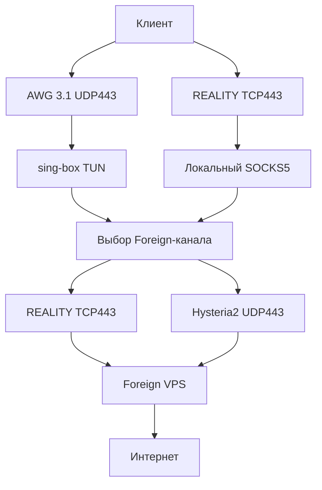
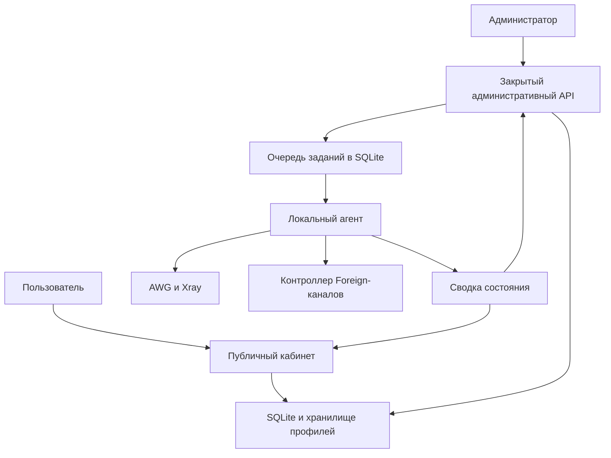

# Семейная VPN-платформа: технические требования и документация разработки

Версия: **1.0** · Дата: **29 сентября 2026** · Язык интерфейса: русский.

Статус: нормативная проектная спецификация для разработки. Документ описывает целевую систему и не подтверждает, что перечисленные компоненты уже установлены или проверены на действующих серверах. Изменение работающей инфраструктуры выполняется только после инвентаризации и проверки миграции.

## 1. Назначение и границы

Создать управляемую систему доступа в интернет для семи близких пользователей: клиент подключается к российскому VPS, а пользовательский трафик выходит через иностранный VPS. Добавить на RU-сервере мобильный личный кабинет с конфигурациями, инструкциями и диагностикой; предоставить администратору изолированный интерфейс управления.

Базовая топология — один RU VPS и один Foreign VPS. Ориентир для RU — Ubuntu, 2 ГБ RAM. Конкретные адреса, версии ОС, ядра и установленные сервисы определяются обследованием; реальные адреса и секреты в документации и репозитории не фиксируются.

Слова **ДОЛЖЕН**, **НЕЛЬЗЯ** обозначают обязательные требования. **СЛЕДУЕТ** — рекомендуемое решение, отступление фиксируется в ADR. Параметры по умолчанию ниже являются проектными настройками, а не измеренными характеристиками.

### 1.1. Результат для пользователя

- Получить приглашение, завести кабинет и подключить телефон или компьютер без SSH.
- Получить отдельные основной и резервный профили для каждого устройства.
- Проверить доступность сервиса и маршрут собственного браузерного запроса.
- Найти короткую инструкцию именно для выбранного приложения и ОС.
- Продолжать использовать установленный VPN при недоступном кабинете.

### 1.2. Результат для администратора

- Выдавать и отзывать доступ отдельного устройства.
- Видеть состояние входов, RU → Foreign, иностранного выхода и канала управления.
- Отличать отказ сервиса от отсутствующей или устаревшей телеметрии.
- Применять ограниченные изменения с аудитом, проверкой и восстановлением.
- Восстанавливать систему через независимый канал управления и консоль провайдера.

### 1.3. Вне первой версии

Оплата, тарифы, биллинг, публичная регистрация, продажа доступа, мультиарендность, кластер, Kubernetes, собственный VPN-протокол, собственное мобильное VPN-приложение, браузерный root-терминал, автоматическая закупка VPS, обещание незаметности для DPI или устойчивости к полной блокировке IP.

Опциональные IKEv2, XHTTP, TrustTunnel, Mieru и другие входы не входят в обязательный релиз. Их подключают через отдельные ADR и тесты совместимости. Предположения о будущих тарифах на зарубежный трафик и действиях регуляторов не являются установленными фактами или основанием для гарантий.

## 2. Неприкосновенные свойства

| ID | Требование |
|---|---|
| INV-01 | Пользовательский интернет-трафик выходит только через разрешённый Foreign-канал. При его отказе трафик блокируется: fail-closed. |
| INV-02 | SSH, обновления, NTP, системный DNS и управление RU используют RU uplink независимо от пользовательского выхода. |
| INV-03 | Остановка портала, его БД или агента не останавливает уже настроенный VPN. Перезапуск агента не очищает конфигурацию. |
| INV-04 | Клиентские профили содержат RU endpoint и только необходимые пользовательские секреты; они не содержат межсерверных или административных ключей. |
| INV-05 | Каждый профиль принадлежит одному устройству одного пользователя. Общие семейные приватные ключи запрещены. |
| INV-06 | Firewall и правила маршрутизации имеют одного владельца. Панель выдачи профилей не переписывает их побочным действием. |
| INV-07 | Пользователь не может читать, перечислять, скачивать или отзывать чужие устройства и профили. |
| INV-08 | Потеря наблюдаемости не отображается как успешная работа. Все результаты имеют время измерения и срок актуальности. |
| INV-09 | Полная блокировка единственного RU IP или Foreign IP не устраняется сменой протокола на том же IP. |
| INV-10 | Автообновление приложения или VPN-ядра без проверенной версии и процедуры отката запрещено. |

INV-04 не означает сокрытие IP выхода: пользователь может узнать свой внешний IP обычным запросом в интернет. Требование относится к конфигурации и секретам инфраструктуры.

## 3. Архитектура

### 3.1. Плоскость передачи трафика



Это логическая схема. SNI-маршрутизатор для совместного использования TCP443 описан отдельно. Поддержка UDP через Xray → SOCKS5 → sing-box ДОЛЖНА быть подтверждена интеграционным тестом на зафиксированных версиях.

На RU VPN-процессы и пользовательская маршрутизация изолируются в network namespace `vpn-data`. Связь с host namespace — через выделенный veth. Точные CIDR выбираются после проверки пересечений с существующими сетями и Docker. Адреса назначаются из пула транзакционно с уникальным ограничением в БД.

Host namespace содержит веб-портал, управление, локальный агент и стандартный RU default route. Пользовательский трафик не может использовать этот default route как запасной путь.

Независимые постоянные nftables-правила блокируют выход из `vpn-data` непосредственно в интернет. Разрешаются только точные соединения с Foreign endpoints и необходимые ответные потоки к клиентам, локальные интерфейсы и служебный ICMP/PMTU. Покрываются IPv4, IPv6, UDP, TCP и соединения, которые локально создают прокси-процессы. Фильтра только по AWG-подсети недостаточно.

В пользовательском selector отсутствует `DIRECT`. При исчезновении TUN или маршрута защитные правила остаются. Обход через DNAT/SNAT, Docker chains, IPv6 default route и DNS проверяется отдельно. В первой версии IPv6 пользовательского VPN явно блокируется до реализации и проверки полного IPv6-маршрута.

Пользовательский DNS проходит через Foreign-канал; DNS хоста отделён. Bootstrap-разрешение имени Foreign выполняется контролируемым механизмом: агент атомарно обновляет ограниченный набор адресов назначения и конфигурацию. Разрешение произвольного прямого DNS из `vpn-data` запрещено. Потеря bootstrap DNS не должна включать обходной прямой выход. Блокирование IPv6 на сервере не предотвращает обход VPN через нативный IPv6 телефона: клиентская конфигурация обязана захватывать IPv6 в туннель с последующей блокировкой либо включать проверенный клиентский запрет IPv6. Без такого теста профиль нельзя описывать как полный туннель без IPv6-утечек.

REALITY camouflage target также требует явного маршрута: разрешённый канал или локальный TLS-сервис. Нельзя ради него открывать общий прямой HTTPS-выход из `vpn-data`.

На Foreign egress запрещён доступ пользователей к административным интерфейсам, loopback, private/link-local сетям и metadata endpoints. Явные исключения задаются только для необходимых внутренних связей прокси; проверяются DNS rebinding и разрешение адресов после получения DNS-ответа.

### 3.2. Плоскость управления



Публичный процесс не имеет доступа к привилегированному socket агента и не пишет в очередь административных команд напрямую. Пользовательский запрос создания/отзыва устройства проходит ограниченный серверный обработчик с проверкой владельца и лимита устройств; он создаёт типизированное намерение. Закрытый reconciler преобразует его в строго ограниченное задание. Команды изменения сети доступны только административному обработчику.

Использование одной SQLite БД само по себе не является границей безопасности: компрометация процесса с доступом к файлу БД угрожает всем содержащимся там данным. В M1 публичная БД содержит учетные записи, устройства, клиентские профили и безопасную сводку. Начиная с M2 привилегированные операции, ревизии и монотонные отзывы хранятся в отдельной SQLite БД закрытого reconciler; UID публичного процесса не имеет прав на этот файл. Общение — через ограниченный локальный API намерений. Агент дополнительно проверяет неизменяемую политику разрешённых операций. Это не устраняет риск кражи или отзыва клиентских доступов при компрометации кабинета, но исключает прямую запись его процессом сетевых команд и истории отзывов.

### 3.3. Компоненты и ответственность

| Компонент | Ответственность | Ограничения |
|---|---|---|
| Frontend | Svelte + TypeScript, статическая сборка, мобильный кабинет и admin UI | Не хранит конфиги в localStorage; не выполняет shell |
| Portal API | Go, auth, ownership, выдача профилей, инструкции, безопасная сводка | Непривилегированный UID; нет Docker socket, root SSH key, NET_ADMIN |
| Admin API/reconciler | Go, проверка команд и сериализация изменений | Отдельный listener, недоступный публичному reverse proxy |
| Node agent | Go, узкие адаптеры AWG/Xray, наблюдение, применение ревизий | Unix socket, проверка peer credentials, allowlist операций; без произвольного exec |
| Hop controller | Проверки каналов и выбор разрешённого outbound | Единственный писатель selector; не добавляет DIRECT |
| Foreign probe | Ограниченный HTTPS endpoint проверки выхода | Не является forward proxy; не принимает произвольные URL |
| SQLite | Учетные записи, устройства, задания, аудит, агрегаты | Миграции и консистентный backup; WAL по результатам тестов |
| Хранилище секретов | Зашифрованные пользовательские профили | Отдельный ключ шифрования; ключи управления отсутствуют в публичном процессе |

Разделение бинарников может быть реализовано режимами одного Go-проекта, но слушатели, UID, файловые права и доступные операции разделяются при запуске. Нельзя считать скрытый frontend route изоляцией API.

## 4. Размещение, порты и управление

| Узел | Слушатель | Назначение |
|---|---|---|
| RU | UDP443 | AWG 3.1 |
| RU | TCP443 | REALITY; позднее SNI dispatcher при совместном размещении |
| RU | TCP8443 | HTTPS кабинета в начальном варианте |
| RU | loopback/private listener | Admin API и UI; доступ через канал управления |
| RU | Unix sockets | Agent/reconciler; не публикуются в сеть |
| Foreign | TCP443 | Основной межсерверный REALITY |
| Foreign | UDP443 | Резервный Hysteria2 |
| Foreign | TCP8443 | HTTPS/WSS управления; endpoint проверки может быть отдельным route того же TLS frontend |
| Foreign | 127.0.0.1:22022 | Обратный доступ к RU sshd; не публиковать |

Это резервирование портов, а не готовые firewall rules. При совпадении с существующими сервисами deployment plan обязан задать альтернативы до запуска.

### 4.1. HTTPS кабинета

Первый релиз использует отдельный домен и TCP8443, сохраняя существующий TCP443 вход. Сертификат валиден для домена независимо от номера порта. Выпуск и продление сертификата заранее проверяются: DNS-01 с ограниченным DNS API token либо HTTP-01 при явно разрешённом TCP80. Не предполагать, что ACME HTTP-01 работает на 8443.

Переход на стандартный TCP443 — отдельный этап: L4 SNI dispatcher направляет hostname кабинета к HTTPS backend, а согласованные REALITY ClientHello — к Xray без TLS termination. Неизвестный SNI обрабатывается по явной политике. ECH/отсутствующий SNI и источники адресов после proxying требуют отдельного решения и тестов. PROXY protocol включается только если принимающий сервис его поддерживает. L4 frontend имеет конфигурацию, независимую от portal API: падение приложения не должно прерывать REALITY, но падение самого dispatcher остаётся общей точкой отказа TCP.

### 4.2. Аварийный доступ

Сохранить OpenSSH и ключевую аутентификацию. Транспорт WSS через wstunnel рассматривается как прямой способ доступа, Chisel WSS reverse — как исходящий канал RU → Foreign. Проверка TLS-сертификата и предусмотренного transport fingerprint обязательна; отключение проверки не является решением ошибок сертификата.

Обратный listener публикуется только на loopback Foreign; доступ администратора к нему — через аутентифицированный jump/forward. Destination ограничен конкретным RU sshd. Панель не заменяет этот канал. У администратора есть доступ к консоли провайдера и сохранённый вне серверов recovery runbook.

Admin UI ДОЛЖЕН использовать документированный HTTPS origin, в том числе при forwarding. Перед использованием WebAuthn фиксируются RP ID и origin; случайная смена домена или обращение по сырому IP не должны становиться единственным способом входа. Резерв — пароль с TOTP и одноразовые recovery codes, плюс локальная процедура восстановления через консоль.

## 5. Роли и авторизация

| Действие | Пользователь | Администратор |
|---|---|---|
| Просмотр инструкций | Да | Да |
| Собственные устройства/профили | Да | Да |
| Чужие устройства | Нет | Да, в admin API |
| Создание устройства | В пределах лимита | Да |
| Отзыв собственного устройства | Да, после подтверждения | Да |
| Приглашения и восстановление учетной записи | Нет | Да |
| Изменение сети/selector | Нет | Да, ограниченные команды |
| Произвольная команда на сервере | Нет | Нет через портал |

**AUTH-01.** Публичной регистрации нет. Приглашение привязано к создаваемому пользователю; срок 24 часа по умолчанию, одно использование. В БД хранится хеш криптографически случайного токена с энтропией не менее 256 бит. Активация атомарна: два параллельных запроса не создают две учётные записи.

**AUTH-02.** Основной удобный способ — passkey через зрелую WebAuthn-библиотеку. Для совместимости допускается пароль, хешируемый Argon2id проверенной библиотекой. Для admin пароль требует TOTP; passkey требует user verification. Восстановление не опирается на обязательный email/Telegram.

**AUTH-03.** Серверные сессии, непрозрачный случайный cookie: Secure, HttpOnly, SameSite=Lax, без Domain. Значение сессии хешируется в БД. Cookies и CSRF токены не хранятся в localStorage. Для мутаций — проверка Origin и CSRF. Login/активация также защищаются от cross-site запросов.

**AUTH-04.** Пользовательская сессия: максимум 30 дней, idle 7 дней; административная: максимум 12 часов, idle 30 минут. Опасные операции требуют свежего подтверждения личности не старше 5 минут. Все значения конфигурируемые. Сброс учётной записи отзывает сессии; VPN-профили отзываются отдельно либо явно выбранной общей операцией.

**AUTH-05.** Recovery codes одноразовые, хешируются. Восстановление через администратора создаёт короткоживущий одноразовый токен, отзывается старый доступ к кабинету и регистрируется событие. Токен нельзя использовать как постоянную ссылку скачивания конфигов.

**AUTH-06.** Ограничение попыток по аккаунту и источнику, задержка с верхней границей; не вводить бессрочную блокировку аккаунта, которую может вызвать посторонний. По умолчанию 5 попыток за 5 минут на аккаунт и 30 на IP; корректировать после теста общего NAT. Ошибки входа не раскрывают существование имени.

## 6. Требования к кабинету

| ID | Требование |
|---|---|
| UX-01 | Русский интерфейс, ширина от 320 CSS px, управление касанием и клавиатурой, видимый focus, статус различим без цвета. |
| UX-02 | Главная: список своих устройств, «Подключить устройство», «Проверить», «Не работает», время последней проверки сервиса. |
| UX-03 | Выбор ОС определяется приблизительно и всегда корректируется вручную. Выбор приложения содержит дату проверки совместимости. |
| UX-04 | Для устройства выдаются основной AWG и резервный REALITY, отдельные кнопки импорта, скачивания, копирования и QR. |
| UX-05 | Deep link предлагается только для реально проверенной пары приложение/формат. Fallback скачивания обязателен. |
| UX-06 | QR строится локально. QR с конфигом считается секретом. Внешние QR API запрещены. |
| UX-07 | Инструкция привязана к OS, app, app version/range, protocol, export format; содержит текст, скриншоты, дату проверки. |
| UX-08 | Кабинет доступен при выключенном VPN через RU uplink; получение уже готового профиля не требует работоспособности Foreign. |
| UX-09 | Скачиваемая офлайн-памятка содержит инструкции и контакт администратора, но не секреты и не чужие профили. |
| UX-10 | Диагностический отчёт перед копированием показывает содержимое; исключает токены, UUID доступа, приватные ключи и конфиги. |

Основной маршрут: приглашение → вход → выбор ОС → название устройства → получение профилей → установка приложения → импорт → включение → проверка → установка резерва.

По умолчанию лимит — 5 активных устройств на пользователя. Это проектная защита от случайного создания, а не тарификация. Администратор может менять лимит.

Состояния устройства: `pending`, `active`, `partial`, `revoking`, `revoked`, `error`. `active` означает подтверждённую установку всех обязательных профилей на сервере, а не факт подключения телефона. `partial` показывает, какой профиль готов и какой нет. UI никогда не называет незавершённый отзыв завершённым.

Приложение кабинета/PWA не включает VPN самостоятельно. Service worker, если появится, кеширует только публичную оболочку и несекретные инструкции; auth API, подписки и профили исключены из кеша. В первой версии service worker необязателен.

## 7. Профили и жизненный цикл доступа

**CFG-01.** Один профиль — одна пара устройство/протокол/поколение. AWG получает отдельную пару ключей и адрес; REALITY — отдельный пользовательский идентификатор. Никакие ключи не выводятся в журнал.

**CFG-02.** Профиль публикуется пользователю только после подтверждения установки на RU и проверки соответствия ожидаемым параметрам. Обязательные общие AWG 3.1 параметры не теряются при чтении, сохранении и экспорте. Нельзя использовать сериализатор более старого AWG без проверки полного round-trip.

**CFG-03.** Поддерживаемые форматы определяются матрицей совместимости. `.conf`, `vpn://`, VLESS URI и подписка не считаются взаимозаменяемыми. Нельзя обещать импорт в приложение только на основании совпадения имени протокола.

**CFG-04.** Файл выдаётся через аутентифицированный endpoint: `Cache-Control: no-store`, корректный Content-Type и Content-Disposition, `Referrer-Policy: no-referrer`. Proxy/access logs не содержат тела ответа и bearer tokens. Секрет не передаётся в query string. Чужой или отсутствующий profile ID возвращает одинаковый 404.

**CFG-05.** Подписки — отдельные опциональные bearer tokens с энтропией ≥256 бит, хранимые только как хеш. Привязаны к устройству, отзываются и ротируются. URL path с токеном маскируется на всех logging layers. Подписка поддерживает только проверенные форматы клиента; автоматическое обновление AWG не предполагается.

**CFG-06.** Отзыв устройства удаляет серверный доступ всех поколений AWG и REALITY и отзывает subscription tokens. Новые соединения должны блокироваться; существующие сессии должны быть завершены поддерживаемым механизмом ядра. Если адаптер не может разорвать сессию адресно, релиз обязан документировать и проверить ограниченный перезапуск сервиса с влиянием на других пользователей. До подтверждения завершения UI показывает `revoking`/`partial`, а не «отозвано».

**CFG-07.** Ротация создаёт новое поколение, устанавливает его, выдаёт пользователю и отзывает старое после подтверждения или заданного grace period. Для инцидента есть немедленный отзыв без grace period. Историческая ревизия не может повторно активировать отозванный доступ.

**CFG-08.** Публичный веб-процесс получает только клиентские конфиги. Экспорты Amnezia «полный доступ» и root-equivalent SSH credentials запрещены в клиентском кабинете.

### 7.1. Хранение секретов

Клиентские конфиги хранятся зашифрованными AEAD средствами стандартной библиотеки или проверенного пакета. Запись содержит `key_id`, nonce и ciphertext; nonce уникален для ключа, AAD включает profile ID и generation. Master key отсутствует в БД и backup-архиве БД, хранится с ограниченными правами и отдельно резервируется у администратора. Ротация ключа поддерживает чтение предыдущей версии до окончания перешифрования.

Шифрование at rest защищает отдельную копию БД, но не спасает конфиги от компрометации процесса, которому разрешена их расшифровка. Это ограничение отражается в threat model. Секреты VPN-узлов и management credentials доступны только агенту/службе управления и не включаются в пользовательские backup/export.

## 8. Диагностика и переключение каналов

### 8.1. Три независимых результата

| Слой | Измерение | Что нельзя из него заключать |
|---|---|---|
| Сервис | Проверки RU → Foreign → internet через конкретный outbound | Что конкретный мобильный оператор пропускает вход на RU |
| Профиль | Последний AWG handshake или наблюдавшаяся Xray сессия | Что всё устройство сейчас онлайн или весь трафик идёт в VPN |
| Браузер | Ответ внешнего HTTPS probe, увидевшего ожидаемый egress IP | Что нет утечек DNS/IPv6 или обхода VPN в других приложениях |

Статусы: `healthy`, `degraded`, `unavailable`, `unknown`. Поля: `measured_at`, `expires_at`, `reason_code`. После `expires_at` статус становится `unknown`; старый результат можно показать только с отметкой времени. Рекомендуемый TTL — 60 секунд при интервале активных проверок 15 секунд.

### 8.2. Endpoint браузерной проверки

Фиксированный HTTPS hostname на Foreign; в первой версии может использовать TCP8443. Браузер делает fetch напрямую, без проксирования через Portal API, с `credentials: omit` и `cache: no-store`. Endpoint отвечает observed source IP, UTC timestamp и переданным ограниченным nonce. CORS разрешает только настроенные origins кабинета. X-Forwarded-For принимается исключительно от доверенного локального proxy, иначе используется адрес сокета. Сервис не выполняет запросы по пользовательским URL.

Сравнение производится с настроенным набором фактических egress IP. При NAT адрес назначения Foreign и его исходящий адрес могут отличаться. Ошибка DNS/TLS/timeout endpoint отображается как «не удалось проверить», без автоматического вывода о причине. Split tunneling браузера объясняется в результате. Endpoint имеет rate limit и не хранит долговременную историю IP посетителей.

### 8.3. Контроллер Foreign-каналов

Selector sing-box сам по себе не является автоматическим контроллером отказов. В проекте единственный controller пишет его состояние через локальный защищённый API. Административное переключение проходит через тот же controller.

- Каждый путь проверяется отдельно, принудительно через собственный outbound.
- Нужны HTTPS и DNS проверки; TCP и UDP оцениваются отдельно. Запуск процесса не равен рабочему интернету.
- По умолчанию: интервал 15 с, timeout 5 с, отказ после 3 последовательных неудач, восстановление после 5 успехов, минимальное удержание выбранного пути 120 с.
- Использовать минимум два независимых контрольных назначения, чтобы отказ одного тестового сайта не переключал сеть без оснований. Их список фиксирован администратором.
- Ручной override имеет срок, например 30 минут; админ видит его влияние. Даже override не может разрешить DIRECT.
- Если оба пути не отвечают, пользовательский интернет блокируется. Уже работающий controller не зависит от БД портала.
- Если controller остановлен, текущий selector сохраняется; firewall по-прежнему fail-closed. Автоматического переключения до восстановления controller нет.
- При изменении пути существующие соединения могут потребовать переподключения. Бесшовность не обещается.

Целевая задержка автоматического перехода в испытании: ≤90 секунд после отказа основного канала, если резерв заранее признан здоровым. Это критерий теста, а не гарантия для любого оператора.

## 9. Модель данных

Идентификаторы — непрозрачные UUID, время — UTC RFC3339 в API. Отображение — в timezone пользователя. Все связи проверяются foreign keys; удаление записей не должно стирать ещё нужный аудит или resurrect отозванные профили.

| Сущность | Основные поля и ограничения |
|---|---|
| User | id, login, display_name, role, state, device_limit, created_at; login unique |
| Credential | id, user_id, kind, credential_id/public_key или password_hash/TOTP encrypted secret; passkey credential_id unique |
| Session | token_hash, user_id, created_at, last_seen_at, expires_at, auth_time, revoked_at |
| Invite / RecoveryToken | token_hash, user_id, purpose, expires_at, consumed_at; single-use |
| Device | id, user_id, name, os, selected_app, state, generation, created_at, revoked_at |
| Profile | id, device_id, protocol, generation, state, config_ciphertext, key_id, public_metadata, installed_revision; unique device/protocol/generation |
| SubscriptionToken | id, device_id, token_hash, format, expires_at nullable, revoked_at |
| Node | id, role RU/Foreign, endpoint references, capabilities, last_seen_at; management secrets в agent store |
| Instruction | id, os, app_id, version_range, protocol, format, content_version, verified_at, body_path |
| Operation | id, actor_id, type, target_id, idempotency_key, request_hash, state, attempts, lease_until, result_code, created_at, finished_at |
| Revision | id, parent_id, schema_version, adapter_versions, desired_hash, applied_hash, state, applied_at |
| Revocation | profile_id/generation, revoked_at, reason; монотонный запрет повторной активации |
| HealthSample | component_id, path_id, check_type, status, measured_at, expires_at, latency_ms, reason_code |
| AuditEvent | id, actor, action, object_ref, outcome, request_id, operation_id, time; без секретов |

Desired state и observed state хранятся раздельно. Успешная запись desired state не считается применённой конфигурацией. Трафик агрегируется по профилю с учетом сброса счетчиков после рестартов; отрицательные дельты не отображаются как отрицательный трафик.

Детальные health samples: 7 дней; часовые агрегаты: 30 дней; аудит: 90 дней по умолчанию. Сроки конфигурируемые. Журнал посещений сайтов и полный журнал DNS-запросов не собираются.

## 10. Контракт HTTP API v1

Базовый путь `/api/v1`. JSON UTF-8. Схема ниже нормативна по семантике; реализация ДОЛЖНА предоставить полный `openapi.yaml` со всеми request/response schemas, auth, enum, validation и примерами. Frontend client генерируется из него либо проверяется контрактными тестами.

### 10.1. Общие правила

- HTTPS обязателен для браузерных API; административные endpoints доступны только на закрытом listener.
- GET не меняет состояние. JSON mutations требуют CSRF/Origin и Content-Type application/json.
- Создание устройства, отзыв, ротация и сетевые команды принимают `Idempotency-Key`. Повтор того же ключа и тела возвращает ту же операцию; другое тело — 409. Хранение ключа минимум 24 часа.
- Изменение ресурса с ревизией использует `If-Match`; устаревшая ревизия — 412. Не перезаписывать изменения другого запроса молча.
- Асинхронная команда возвращает 202 и operation ID; 202 не означает, что доступ уже создан/отозван.
- Ошибки: 400 validation, 401 auth, 403 forbidden, 404 absent/not-owned, 409 conflict, 412 stale revision, 429 rate limit, 503 dependency unavailable. Ответ 429 содержит Retry-After.
- Формат ошибки: `{ "error": { "code": "PROFILE_NOT_READY", "message": "Профиль ещё создаётся", "request_id": "...", "retryable": true } }`. Stack trace, shell output и секреты не публикуются.
- Пагинация списков — opaque cursor, limit 1–100, по умолчанию 20. Размер обычного JSON body ≤64 KiB; большие backup/import операции в v1 выполняются отдельным CLI.

### 10.2. Публичный listener

| Метод и путь | Доступ | Результат |
|---|---|---|
| POST /auth/invitations/accept | Токен приглашения | Активация с выбранным поддерживаемым credential flow |
| POST /auth/login | Анонимный, rate limited | Парольный flow; admin требует второй фактор на закрытом listener |
| POST /auth/passkeys/options | Анонимный или сессия по flow | Одноразовый challenge, срок 5 минут |
| POST /auth/passkeys/verify | Challenge | Проверка origin/RP ID/user verification; создание сессии |
| POST /auth/logout | Сессия | Отзыв текущей сессии |
| GET /me | Сессия | Собственный пользователь и permissions |
| GET /devices | Сессия | Только собственные устройства |
| POST /devices | Сессия | `{name, os, app_id}` → 202 operation; протоколы из серверной политики |
| GET /devices/{id} | Владелец | Состояния профилей без секретов |
| POST /devices/{id}/revoke | Владелец, fresh auth | 202 operation отзыва |
| POST /devices/{id}/rotate | Владелец, fresh auth | 202 operation смены поколения |
| GET /profiles/{id}/download?format=... | Владелец | Секретный файл после проверки готовности |
| POST /devices/{id}/subscription-token | Владелец, fresh auth | Токен показывается один раз; только если format разрешен |
| GET /subscriptions/{token} | Bearer token | Разрешённые профили одного устройства; access log token masked |
| GET /instructions | Сессия | Фильтр os/app/protocol, проверенные инструкции |
| GET /status | Сессия | Обезличенная сводка с freshness; без внутренней топологии и чужой активности |
| GET /diagnostics/browser-check | Сессия | Фиксированный probe URL и expected egress set; без пользовательского URL |
| GET /operations/{id} | Автор/владелец объекта | Безопасное состояние собственной операции |

Query `format` не секретен. Invite token передаётся POST body; ссылка приглашения использует fragment и очищается через history replacement после извлечения, чтобы не попадать в access logs и referrer. Это не отменяет защиту от утечек через историю/буфер обмена.

Auth enrollment/recovery подмаршруты, управление сессиями и passkeys уточняются в OpenAPI первой итерации. Они обязаны сохранять требования AUTH; нельзя считать отсутствующий в таблице endpoint разрешением обойти авторизацию.

### 10.3. Закрытый административный listener

| Метод и путь | Результат |
|---|---|
| GET /admin/overview | Полная сводка, ресурсы, freshness, текущая ревизия |
| GET/POST /admin/users | Пользователи / создание пользователя |
| POST /admin/users/{id}/invites | Одноразовое приглашение |
| POST /admin/users/{id}/recovery | Отзыв сессий и одноразовое восстановление |
| GET /admin/devices | Фильтры user, state; без plaintext конфигов в списке |
| POST /admin/devices/{id}/revoke | Отзыв всех поколений и подписок |
| GET /admin/nodes | Состояние компонентов и версии |
| POST /admin/hop/override | `{path_id, ttl_seconds}`; только allowlisted path |
| DELETE /admin/hop/override | Возврат автоматического выбора |
| GET /admin/revisions | История без секретов |
| POST /admin/revisions/{id}/restore | Новая операция на основе старой ревизии с учетом текущих отзывов |
| GET /admin/operations/{id} | Подробности выполнения, отредактированные ошибки |
| GET /admin/audit | Аудит с фильтрами |

Админские endpoints на публичном listener всегда отсутствуют, независимо от переданных cookies или role claims. Роль берется из доверенного серверного состояния, а не из body запроса.

## 11. Контракт агента и надежность изменений

Локальный transport — Unix domain socket, права 0660, выделенная группа и проверка UID клиента. Socket не монтируется в публичный контейнер. JSON-команды версионируются, имеют max size и timeout.

Envelope: `schema_version`, `operation_id`, `type`, `target_id`, `expected_revision`, `payload`. Ответ: `operation_id`, `state`, `observed_revision`, `result_code`, безопасное описание.

Разрешённые операции: `ReadState`, `EnsureDeviceProfiles`, `RevokeDeviceProfiles`, `RotateDeviceProfiles`, `ValidateRevision`, `ApplyRevision`, `RestoreRevision`, `SetHopOverride`, `ClearHopOverride`. Полный привилегированный payload составляет доверенный reconciler. Клиент не задаёт произвольные пути файлов, команды, имена systemd units, endpoints или Xray/sing-box JSON.

Для v1 агент работает с заранее установленными ядрами и фиксированными шаблонами. Установка VPN-ядра и изменение firewall выполняются отдельным инфраструктурным CLI. Добавление peer не вызывает `awg-quick down/up` всего интерфейса без явной необходимости; live update и persistent state должны согласовываться.

### 11.1. Автомат состояний операции

`queued → running → succeeded | failed | partial`; после потери исполнителя операция становится `reconciling`, затем получает наблюдаемый результат либо повторяется идемпотентно. Отмена возможна только до применения; «отменить HTTP-запрос» не означает отменить серверную операцию.

Алгоритм применения:

1. Проверить права инициатора, инварианты, лимиты, ревизию и idempotency key.
2. Под блокировкой мутаций узла получить observed state и сохранить intent.
3. Сгенерировать новую ревизию во временном каталоге с ограниченными правами.
4. Проверить синтаксис штатными средствами ядер и семантику проекта: Foreign-only egress, допустимые адреса/порты, отсутствие лишних inbound/admin listeners.
5. Зафиксировать checkpoint до изменения runtime.
6. Применить минимальный delta, проверить runtime и persistent configuration.
7. Сохранить observed revision и результат; только после этого открыть профиль для скачивания.
8. При ошибке восстановить предыдущую рабочую сетевую конфигурацию с учетом монотонного списка отзывов. Не возвращать отозванные ключи.

Файловая атомарная замена не делает всю сеть транзакционной. Тесты обязаны прерывать процесс между runtime update, disk write и DB commit. Агент при старте сверяет желаемое и фактическое состояния; неизвестные существующие peers не удаляет автоматически. Импорт и принятие под управление выполняются отдельным явным шагом.

Отзыв имеет приоритет над выдачей. Повтор отзыва безопасен. При недоступном агенте скачивание готовых конфигов работает, мутации остаются pending, UI показывает причину; очередь не теряется при перезапуске.

## 12. Нефункциональные требования

| ID | Целевой критерий |
|---|---|
| NFR-01 | 7 пользователей, до 35 активных устройств; испытание кабинета при 10 параллельных сессиях. |
| NFR-02 | Собственный портал, admin API, agent и SQLite вместе: целевой steady-state RSS ≤250 MiB, без учета VPN-ядер и системного TLS frontend; подтверждается измерением. |
| NFR-03 | Обычный API p95 ≤300 мс на сервере без времени внешней сети; тяжелые операции асинхронные. |
| NFR-04 | Начальная frontend загрузка ≤500 KiB compressed без скриншотов; изображения ленивые. |
| NFR-05 | Выдача готового конфига ≤1 секунды серверного времени. Создание профиля в исправной сети — целевой срок ≤10 секунд. |
| NFR-06 | Подтвержденный отзыв в исправной системе ≤10 секунд; при ошибке явно незавершенный статус и алерт. |
| NFR-07 | Все демоны имеют restart policy, ограниченные логи и resource limits; рестарт портала не рестартит ядра. |
| NFR-08 | Backup RPO ≤24 часа для обычных данных; целевой RTO восстановления ≤60 минут при доступном чистом сервере и recovery kit. Эти цели проверяются репетицией. |
| NFR-09 | Секреты отсутствуют в логах, frontend source maps, error responses, metrics labels, screenshots тестов и репозитории. |

Цели памяти не являются обещанием полной пропускной способности VPS. Отдельно измеряются CPU, память и throughput ядер с выбранными протоколами. Сборка frontend выполняется вне рабочего VPS. На RU 2 ГБ не добавлять обязательные Grafana/Prometheus/Redis только ради семи пользователей.

Web security: CSP без ненужных внешних источников, frame-ancestors 'none', nosniff, no-referrer для чувствительных страниц; HSTS включать после проверки HTTPS и recovery сценария. Применить ограничения body/timeout, защиту от path traversal и SSRF, отсутствие произвольной загрузки URL в диагностике. Локальные Unix socket и БД не доступны через static file server.

## 13. Разработка, структура репозитория и ADR

```text
cmd/portal/              публичный API
cmd/admin/               закрытый API и reconciler
cmd/node-agent/          узкие операции на RU
cmd/hop-controller/      проверки и выбор outbound
cmd/foreign-probe/       браузерная проверка
internal/auth/          сессии, WebAuthn, recovery
internal/domain/        устройства, профили, операции
internal/store/         SQLite, migrations, transactions
internal/adapters/      AWG, Xray, sing-box
internal/secrets/       AEAD, key rotation
web/                    Svelte, TypeScript
api/openapi.yaml        внешний контракт
api/agent-schema/       версионированные команды агента
deploy/systemd/         units и ограничения процессов
deploy/templates/       конфиги с placeholders, без секретов
infra/                  отдельный bootstrap и network policy
docs/adr/               архитектурные решения
docs/runbooks/          эксплуатация и восстановление
tests/integration/      namespaces и реальные ядра
tests/e2e/              браузерные и сценарные проверки
```

Предпочтение — systemd для собственного приложения и агентов; не переносить существующие контейнеры автоматически. Если ядро уже в Docker, адаптер интегрируется с ним по документированной модели доступа, а не выдаёт docker.sock публичному процессу. Нельзя поддерживать два независимых источника истины конфигов: импортируемые Amnezia установки переводятся под управление явно.

Версии Go, Node build toolchain, Svelte, Xray, sing-box, AWG server/client фиксируются в compatibility manifest, lockfiles и release metadata при начале реализации. Использование `latest` в production запрещено. Переход версии ядра — отдельная проверяемая операция. Точные версии не угадываются по этому документу.

Обязательные ADR:

- ADR-001: namespaces, firewall ownership и маршрутизация.
- ADR-002: публичный кабинет/закрытый API/агент и границы доверия.
- ADR-003: auth, recovery, RP ID/origin и management forwarding.
- ADR-004: форматы AWG 3.1/REALITY и совместимость клиентов.
- ADR-005: транзакции применения, reconcile и монотонные отзывы.
- ADR-006: порт 8443 либо SNI frontend на 443, ACME и конфликт management/probe listeners.
- ADR-007: хранение ключей, backup, восстановление и риск старых отзывов.

## 14. План реализации и критерии этапов

### M0 — инвентаризация и стенд

Снять версии, interfaces, маршруты, nftables, systemd/Docker, занятые порты и действующие профили. Сделать зашифрованный backup. Создать стенд с той же изоляцией. Проверить аварийный вход до изменения SSH/firewall. Определить CIDR, домены и фактический Foreign egress IP. Выход: deployment inventory, compatibility manifest и ADR-001/006; действующие серверы еще не меняются.

### M1 — кабинет и выдача готовых профилей

Auth, инструкции, устройства, импорт клиентских профилей доверенным CLI, скачивание/QR, read-only status. Админский UI показывает импортированные устройства. Самостоятельная автоматическая выдача пока скрыта; запрос нового устройства может быть явно ручным. Выход: AUTH/UX/ownership tests, отсутствие секретов в логах, отключение портала не влияет на VPN.

### M2 — агент и управление доступом

AWG/Xray adapters, очередь, idempotency, create/rotate/revoke, reconcile после crash. Публичные намерения проходят ограниченный локальный API; готовые профили появляются только после подтверждения. Выход: адресный отзыв обоих протоколов, crash/retry/конкурентные изменения, сохранение INV-01 и INV-06.

### M3 — полноценная диагностика и failover

Foreign probe, проверки каждого пути TCP/UDP/DNS, controller hysteresis, fresh/stale UI, временный manual override. Выход: инъекция отказов и корректные пользовательские подсказки; отсутствие DIRECT во всех аварийных сценариях.

### M4 — эксплуатационная готовность

Backup/restore rehearsal, обновление/rollback, проверка iOS/Android/Windows, офлайн-памятка, resource measurements. Опционально переход кабинета на общий TCP443 после отдельного теста. Выход: заполненный acceptance report и release checklist без критических незакрытых пунктов.

Сроки в днях не фиксируются до M0: совместимость существующей установки и клиентов — основной источник неопределенности. M1 можно использовать раньше автоматизации, если ручной процесс выдачи явно обозначен.

## 15. Матрица приемки

| ID | Проверка | Ожидаемый результат |
|---|---|---|
| AT-01 | Остановить portal API и БД | Установленные VPN-сессии работают; управление SSH доступно |
| AT-02 | Остановить Foreign primary, оставить backup | Переход ≤90 с в условиях испытания; наружный IP разрешённый Foreign |
| AT-03 | Остановить оба Foreign пути | Пользовательский интернет недоступен; выхода через RU IP нет; RU apt/SSH остаются |
| AT-04 | Убить sing-box, удалить TUN/default route внутри namespace | Прямой пользовательский выход заблокирован, включая locally originated proxy sockets |
| AT-05 | Проверить IPv6, DNS и Docker chains при отказе | Обхода защитной границы нет |
| AT-06 | User A запрашивает device/profile/operation пользователя B | 404 без утечки метаданных и конфигов |
| AT-07 | Вызвать admin API через публичный listener | Endpoint недоступен даже с admin cookie |
| AT-08 | Два запроса создания с одинаковым Idempotency-Key | Один набор профилей и одна операция |
| AT-09 | Два создания занимают последний свободный адрес/слот | Один успех, один корректный отказ; дубликатов нет |
| AT-10 | Повторно использовать invite/recovery token | Отказ без новой сессии/аккаунта |
| AT-11 | Прервать agent между runtime update и DB commit | Reconcile определяет состояние; нет дублирования и ложного успеха |
| AT-12 | Отозвать устройство с активными AWG и REALITY сессиями | Оба доступа прекращены; соседнее устройство работает либо влияние явно соответствует принятому ADR |
| AT-13 | Восстановить старую конфигурационную ревизию | Позднее отозванные ключи остаются отозванными |
| AT-14 | Выключить probe endpoint при рабочем VPN | «Не удалось проверить», без ложного «VPN сломан» |
| AT-15 | Остановить сборщик метрик | После TTL данные отмечены устаревшими/unknown |
| AT-16 | VPN off/on и split tunneling браузера | Результат соответствует пути запроса, без утверждений обо всём устройстве |
| AT-17 | Недоступен RU portal/IP | Ранее выданные профили и офлайн-памятка доступны локально; UI не обещает восстановления блокированного IP |
| AT-18 | Импорт AWG 3.1 и REALITY на iOS/Android/Windows | Зафиксированы app version, OS version, формат и фактический успешный доступ |
| AT-19 | Открыть кабинет на 320 px и пройти с клавиатуры | Нет горизонтального скролла основных экранов; доступна установка и отзыв |
| AT-20 | Проверить logs, errors, proxy logs, backups metadata | Нет plaintext ключей/токенов; backup secrets защищены |
| AT-21 | Восстановить backup на чистом стенде | Вход восстановлен, правила fail-closed действуют до старта трафика, профили сверены |
| AT-22 | Перезапустить RU | Firewall загружается до VPN; нет временного прямого выхода |
| AT-23 | Клиент пытается обратиться к metadata/admin/private destinations через Foreign | Доступ закрыт по IPv4 и IPv6, в том числе после DNS resolution |
| AT-24 | Общий TCP443: остановить portal backend | REALITY продолжает работать; SNI routing соответствует ADR |

Доказательство отсутствия утечек: packet capture на RU uplink и контрольные внешние endpoints при одновременной генерации TCP/UDP/DNS/IPv6 трафика. Проверки одного сайта «мой IP» недостаточно. Артефакты испытаний очищаются от пользовательских секретов.

## 16. Эксплуатационные процедуры

### 16.1. Обновление

1. Проверить доступ через management channel и консоль провайдера.
2. Создать консистентный backup БД и секретного состояния, записать версии/хеши.
3. Проверить новую сборку и миграции на копии данных стенда.
4. Обновить один компонент; не обновлять одновременно portal, firewall и VPN core.
5. Выполнить короткие smoke checks: auth, скачивание, путь клиента, управление, fail-closed при тестовом отказе.
6. При ошибке остановить дальнейший rollout и выполнить совместимый rollback. Откат бинарника не предполагает обратимость миграции БД; несовместимая миграция требует согласованного восстановления данных.

### 16.2. Backup и восстановление

Backup содержит консистентную SQLite snapshot через штатный backup API/эквивалент, encrypted profile store, manifests, инструкции, конфигурационные ревизии и отдельный защищённый agent state. Простое копирование одного `.db` при активном WAL недостаточно. Архив шифруется до передачи и хранится вне RU сервера. Master keys и management recovery kit резервируются отдельно.

Восстановление старой БД может вернуть доступ, отозванный после backup. Поэтому revocation journal резервируется отдельно после изменений. При неизвестной свежести журнала восстановленный узел стартует с заблокированным пользовательским доступом; администратор сверяет профили или перевыпускает ключи до открытия входа. Нельзя обещать отсутствие восстановления старых доступов только за счёт ежедневного backup.

Последовательность restore: host management → секреты/БД → firewall fail-closed → ядра и reconcile → проверка отзывов → контролируемое открытие клиентского входа → кабинет. RPO/RTO измеряются по журналу репетиции.

### 16.3. Потеря доступа пользователем

Проверить кабинет и статус сервиса; если сервис исправен — дать инструкцию резервного входа. Если кабинет недоступен — использовать заранее выданный профиль и памятку. При блокировке RU IP потребуется новая точка входа и обновление профиля; автоподписка помогает лишь приложениям, которые ее поддерживают и могут получить обновление. AWG профиль может потребовать ручного переимпорта.

### 16.4. Алерты

Обязательны локальные события: оба Foreign канала недоступны, backlog/reconcile error, незавершенный отзыв, нехватка диска, просроченная телеметрия, срок TLS-сертификата <14 дней, drift конфигурации. Внешние уведомления подключаются опционально по явно настроенному каналу, без конфигов и секретов в сообщении. Дедупликация, cooldown и recovery event обязательны. Отказ внешних уведомлений не влияет на VPN.

## 17. Риски и решения до production

| Риск/неизвестность | Как закрывается |
|---|---|
| Фактическая версия AWG и формат экспорта 3.1 | M0 inventory, round-trip config test, реальный импорт на устройствах |
| Доступность iOS клиента в RU Store | Ручная проверка установки с соответствующего аккаунта; публичная страница не доказательство установки |
| Несовместимость UDP в цепочке прокси | Интеграционный DNS/UDP test каждого выбранного клиента и ядра |
| Общая судьба data и management на одном Foreign IP | Явно принятый риск бюджета 1+1; консоль провайдера обязательна |
| Полная блокировка RU IP | Процедура смены endpoint, заранее выданный резерв и офлайн-инструкции; нет гарантии продолжения на том же IP |
| Компрометация публичного кабинета | Минимальные права, отсутствие root/межсерверных секретов, ограниченный agent API; plaintext доступные кабинету конфиги всё равно под угрозой |
| Готовая VPN-панель меняет сеть | Не устанавливать поверх действующей схемы без проверки; запрещён второй писатель конфигурации |
| Адресный revoke активных Xray-сессий | Проверка конкретного API/ядра; документированный bounded restart при отсутствии адресного механизма |
| Устаревший backup resurrect keys | Свежий revocation journal или закрытый старт и перевыпуск |
| Перегрузка VPS 2 ГБ | Измерения M4, resource limits, frontend build вне VPS |

Выбор домена, CIDR, фактических версий, сертификатного challenge и клиентских приложений — deployment inputs, обязательные к заполнению перед production. Они не блокируют разработку доменной модели, API и интерфейса с fake adapters.

## 18. Источники и основания решений

Официальные документы и репозитории, использованные при проектировании; дата сведения требований — 2026-09-29. Они подтверждают возможности компонентов, но не факт совместимости всей собранной системы. Перед фиксацией версий проверять актуальную документацию соответствующего релиза.

- AmneziaWG: https://docs.amnezia.org/documentation/amnezia-wg/
- Альтернативные клиенты Amnezia: https://docs.amnezia.org/documentation/alternative-clients/
- sing-box selector: https://sing-box.sagernet.org/configuration/outbound/selector/
- NGINX SNI preread без TLS termination: https://nginx.org/en/docs/stream/ngx_stream_ssl_preread_module.html
- wstunnel: https://github.com/erebe/wstunnel
- Chisel: https://github.com/jpillora/chisel
- Marzban: https://github.com/Gozargah/Marzban
- Remnawave requirements: https://docs.rw/install/requirements/
- Remnawave subscription page: https://docs.rw/install/remnawave-subscription-page/
- WGDashboard releases: https://github.com/WGDashboard/WGDashboard/releases
- Amnezia Control: https://github.com/mihsergeev/amnezia-control

Готовые панели оставлены как альтернативы для отдельных адаптеров. В базовый scope не входит их установка: поддержка нужного AWG 3.1 и сохранение namespace/firewall инвариантов не подтверждены этой спецификацией. Собственный код не считается безопаснее готового автоматически; он выбран ради узкой интеграции и требует перечисленных проверок.

## 19. Definition of Done и задание исполнителю

Релиз готов, когда:

- Реализованы обязательные требования, а отклонения имеют согласованный ADR.
- OpenAPI и agent schema полны; миграции и pinned versions воспроизводимы.
- Все применимые AT проходят; AT-24 обязателен только при включенном общем TCP443.
- На реальных целевых устройствах подтверждены основной и резервный способы импорта.
- Есть deployment inventory, compatibility matrix, acceptance report, инструкции установки, обновления, rollback и recovery.
- Проверено, что portal outage не влияет на пользовательский трафик, а Foreign outage не создаёт прямой выход через RU.
- Резервная копия восстановлена на стенде; проверено поведение более поздних отзывов.

**Порядок работы разработчика/Codex:** прочитать спецификацию целиком; начать с M0 на данных обследования или безопасного локального стенда, затем M1. Не подключаться к production и не менять его firewall автоматически из этой документации. Использовать fake adapters до интеграционных тестов. Каждая итерация сдаёт работающий вертикальный сценарий, тесты существенных границ и короткий отчет о выполненных требованиях/оставшихся рисках. Не добавлять незаказанные протоколы и сервисы. Сетевые инварианты имеют приоритет над удобством панели.
